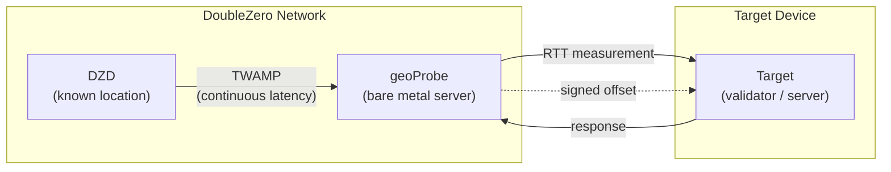
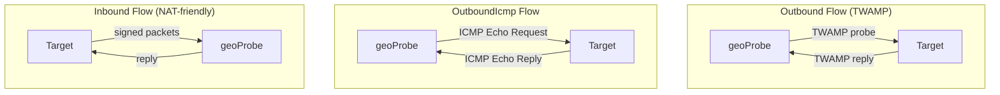
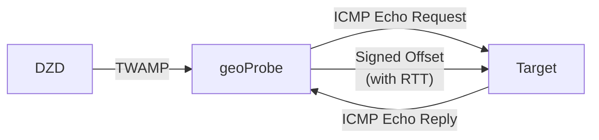

# Geolocation

DoubleZero Geolocation is a service for verifying the physical location of devices using latency measurements. [RTT](glossary.md#rtt-round-trip-time) (round-trip time) measurements between known-location infrastructure and a target device provide cryptographically-signed proof that a device is within a certain distance of a given point. Onchain recording of measurements to the DoubleZero Ledger is planned for a future release.

Use cases include regulatory compliance (e.g., GDPR — proving validators operate within the EU), geographic distribution audits, and any application that needs verifiable proof of where a device is running.

---

## How it works



The following diagram shows the three probe flow types — Outbound, OutboundIcmp, and Inbound — which differ in how the geoProbe communicates with the target:



Geolocation uses a three-tier measurement chain:

```
DZD (known location) ──TWAMP──► geoProbe ──RTT──► Target device
```

- **[DZD](glossary.md#dzd-doublezero-device) <-> geoProbe**: [TWAMP](glossary.md#twamp-two-way-active-measurement-protocol) continuously measures latency between the DoubleZero Device and the probe. DZDs have known, fixed geographic coordinates.
- **geoProbe <-> Target**: RTT is measured between the probe and the device being located.

Offset results are cryptographically signed. Onchain recording to the DoubleZero Ledger is planned for a future release.

**Important:** Geolocation reports RTT only — not inferred distance or coordinates. A common method would be to divide the RTT by 2, and then multiply by the speed of light through glass to provide a radius around the DZD coordinates that the target is located within. How you interpret RTT (e.g., computing a maximum-distance radius) is up to you.

### Probe flow types

There are three ways a probe can measure a target:

| Flow | Who initiates | Protocol | Use when |
|------|---------------|----------|----------|
| **Outbound** | Probe -> Target | [TWAMP](glossary.md#twamp-two-way-active-measurement-protocol) | Target has a public IP, open inbound port, and can run a TWAMP reflector |
| **OutboundIcmp** | Probe -> Target | ICMP echo | Target has a public IP but cannot run a TWAMP reflector (or TWAMP is blocked by firewall) |
| **Inbound** | Target -> Probe | Signed TWAMP | Target is behind NAT or cannot accept inbound connections |

In all cases, the DZD <-> geoProbe measurement happens the same way. Only the direction and protocol of the geoProbe <-> target communication differs.

### OutboundIcmp

The OutboundIcmp flow uses standard ICMP echo (ping) to measure [RTT](glossary.md#rtt-round-trip-time) to the target. The geoProbe sends ICMP echo requests to the target and measures RTT from the echo reply.



Key advantages of OutboundIcmp:

- **No software installation required on the target** — it only needs to respond to ICMP pings
- Useful when [TWAMP](glossary.md#twamp-two-way-active-measurement-protocol) traffic is blocked by firewall rules
- Works when the target cannot run custom software (e.g., managed infrastructure)

!!! info "Technical Specification"
    For the full technical specification of the geolocation verification system, including cryptographic signing details and the measurement protocol, see [RFC 16: Geolocation Verification](https://github.com/malbeclabs/doublezero/blob/main/rfcs/rfc16-geolocation-verification.md).

---

## Prerequisites

### 1. DoubleZero ID with credits

Geolocation users need a funded DoubleZero ID. You do not need to connect to the DoubleZero network (no access pass required), but your key needs credits on the DoubleZero ledger to create a user account and manage targets — each add/remove target operation costs credits.

If you don't have a DoubleZero ID:

```bash
doublezero keygen
doublezero address   # get your pubkey
```

Contact the DoubleZero team with your pubkey to get your ID funded. Fund it to a higher-than-typical amount if you expect to add and remove targets dynamically.

### 2. 2Z token account

You need a [2Z token](glossary.md#2z-token) account. Service fees are deducted from this account on a per-epoch basis.

---

## Installation

```bash
sudo apt install doublezero-geolocation
```

This installs two binaries:

- **`doublezero-geolocation`** — CLI for managing users, probes, and targets on the DoubleZero ledger
- **`doublezero-geoprobe-target-sender`** — runs on the device being measured; used for inbound probe flows

!!! note "Package contents"
    The `doublezero-geolocation` package provides the CLI for all geolocation management commands (creating users, managing targets, listing probes). Both geolocation **users** and **contributors** use this same package.

---

## Check your balance

```bash
doublezero balance --env testnet
```

---

## Setup

### Step 1: Create a geolocation user

```bash
doublezero-geolocation user create \
  --env testnet \
  --code <your-user-code> \
  --token-account <your-2Z-token-account>
```

- `--code`: a short, unique identifier for your account (e.g. `myorg`)
- `--token-account`: the public key of your [2Z token](glossary.md#2z-token) account — service fees are deducted from here

!!! note "Account activation"
    After creating a user, contact the DoubleZero Foundation to activate your account. Payment status must be marked active before probing begins.

### Step 2: List available probes

```bash
doublezero-geolocation probe list --env testnet
```

Note the **code**, **IP address**, and **public key** of the probe you want to use.

### Step 3: Add a target

=== "Outbound (probe sends TWAMP to target)"

    Use this flow if your target has a public IP, an open inbound port, and can run a [TWAMP](glossary.md#twamp-two-way-active-measurement-protocol) reflector.

    ```bash
    doublezero-geolocation user add-target \
      --env testnet \
      --user <your-user-code> \
      --type outbound \
      --probe <probe-code> \
      --ip-address <target-public-ip> \
      --location-offset-port <port>
    ```

    - `--ip-address`: the public IPv4 address of the target device
    - `--location-offset-port`: the port on the target that the probe will send measurements to

=== "OutboundIcmp (probe pings target)"

    Use this flow if your target has a public IP but cannot run a TWAMP reflector, or if TWAMP traffic is blocked by firewall. The target only needs to respond to ICMP echo (ping) requests — no additional software required.

    ```bash
    doublezero-geolocation user add-target \
      --env testnet \
      --user <your-user-code> \
      --type OutboundIcmp \
      --probe <probe-code> \
      --ip-address <target-public-ip> \
      --location-offset-port <port>
    ```

    - `--ip-address`: the public IPv4 address of the target device
    - `--location-offset-port`: the port on the target where the probe will send signed LocationOffset results

=== "Inbound (target sends to probe)"

    Use this flow if your target is behind NAT or cannot accept inbound connections.

    ```bash
    doublezero-geolocation user add-target \
      --env testnet \
      --user <your-user-code> \
      --type inbound \
      --probe <probe-code> \
      --target-pk <target-keypair-pubkey>
    ```

    - `--probe`: the code of the geoProbe that will measure the target (e.g. `ams-tn-gp1`)
    - `--target-pk`: public key of the keypair the target will use to sign messages — the probe only accepts messages from registered public keys

### Step 3b: Set a result destination (optional)

Configure an alternate `host:port` where composite LocationOffset results are delivered, in addition to each target's location offset port. This is useful for aggregating results from multiple targets to a single endpoint.

```bash
doublezero-geolocation user set-result-destination \
  --env testnet \
  --user <your-user-code> \
  --destination <host:port>
```

- `--destination`: a publicly routable IPv4 address or valid domain name with port (e.g., `203.0.113.10:9000` or `results.example.com:9000`). Pass an empty string to clear.

Use `user get` to verify your result destination:

```bash
doublezero-geolocation user get --env testnet --user <your-user-code>
```

### Step 4: Run the target application

Both outbound and inbound flows require running an application on the target device. Reference implementations with examples are available in Go and Rust — you can run them directly or use them as a starting point for your own integration.

=== "Outbound"

    For outbound probing, the target device must run a [TWAMP](glossary.md#twamp-two-way-active-measurement-protocol) reflector so the geoProbe can measure RTT. Run the target application on the device being measured:

    ```bash
    doublezero-geoprobe-target-sender \
      -probe-ip <probe-ip> \
      -probe-pk <probe-pubkey> \
      -keypair <path-to-keypair.json>
    ```

=== "Inbound"

    For inbound probing, the target device must run software that sends signed messages to the probe.

    On the device being measured:

    ```bash
    doublezero-geoprobe-target-sender \
      -probe-ip <probe-ip> \
      -probe-pk <probe-pubkey> \
      -keypair <path-to-keypair.json>
    ```

- `-probe-ip`: IP address of the geoProbe (from `probe list`)
- `-probe-pk`: public key of the geoProbe (from `probe list`)
- `-keypair`: path to the keypair whose public key was registered as `--target-pk` in Step 3

The target sender uses a two-probe-pair mechanism: it sends two pre-signed [TWAMP](glossary.md#twamp-two-way-active-measurement-protocol) probes in quick succession. The probe's reply to the second packet includes `SinceLastRxNs` — the time between the probe sending reply 0 and receiving probe 1 — which serves as the probe-measured [RTT](glossary.md#rtt-round-trip-time). This paired approach provides an accurate RTT measurement even when the target cannot perform precise kernel-level timestamping.

---

## Command reference

### `doublezero-geolocation user`

| Subcommand | Description |
|------------|-------------|
| `create` | Create a new geolocation user account |
| `get` | Get details of a specific user |
| `list` | List all geolocation users |
| `delete` | Delete a user |
| `add-target` | Add a target to a user |
| `remove-target` | Remove a target from a user |
| `set-result-destination` | Set an alternate host:port for offset delivery |
| `update-payment` | Update payment status (foundation use) |

### `doublezero-geolocation probe`

| Subcommand | Description |
|------------|-------------|
| `create` | Register a new geoProbe |
| `get` | Get details of a specific probe |
| `list` | List all probes |
| `update` | Update probe configuration |
| `delete` | Delete a probe |
| `add-parent` | Link a DZD as a parent of the probe |
| `remove-parent` | Remove a parent DZD |

### Global flags

| Flag | Description |
|------|-------------|
| `--env` | Network environment: `testnet`, `devnet`, or `mainnet-beta` |
| `--rpc-url` | Custom Solana RPC endpoint |
| `--keypair` | Path to signing keypair (required for write operations) |
