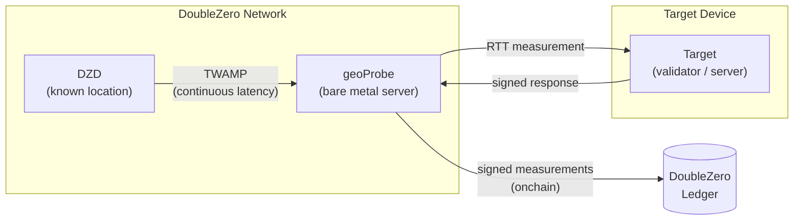
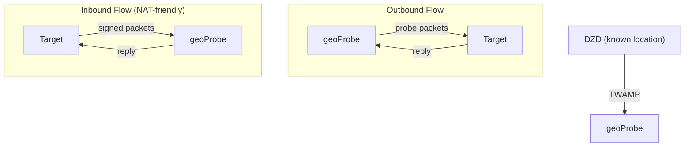

# Geolocation

DoubleZero Geolocation is a service for verifying the physical location of devices using latency measurements. RTT (round-trip time) measurements between known-location infrastructure and a target device provide cryptographically-signed, onchain proof that a device is within a certain distance of a given point.

Use cases include regulatory compliance (e.g., GDPR — proving validators operate within the EU), geographic distribution audits, and any application that needs verifiable proof of where a device is running.

---

## How it works




And here's a second one showing the inbound vs outbound distinction, which might be more useful:



Geolocation uses a three-tier measurement chain:

```
DZD (known location) ──TWAMP──► geoProbe ──RTT──► Target device
```

- **DZD ↔ geoProbe**: TWAMP continuously measures latency between the DoubleZero Device and the probe. DZDs have known, fixed geographic coordinates.
- **geoProbe ↔ Target**: RTT is measured between the probe and the device being located.

All measurements are cryptographically signed and recorded onchain.

**Important:** Geolocation reports RTT only — not inferred distance or coordinates. The speed of light through fiber (~124 miles per millisecond) provides a physical upper bound on how far a device can be from a probe. RTT is not divided by two, since round-trip asymmetry cannot be assumed. How you interpret RTT (e.g., computing a maximum-distance radius) is up to you.

### Inbound vs outbound probe flows

There are two ways a probe can measure a target:

| Flow | Who initiates the connection | Use when |
|------|------------------------------|----------|
| **Outbound** | Probe → Target | Target has a public IP with an open inbound port |
| **Inbound** | Target → Probe | Target is behind NAT or cannot accept inbound connections |

In both cases, the DZD ↔ probe measurement happens the same way. Only the direction of the probe ↔ target communication differs.

---

## Prerequisites

### 1. DoubleZero ID with credits

Geolocation users need a funded DoubleZero ID. You do not need to connect to the DoubleZero network (no access pass required), but your key needs credits on the DoubleZero ledger to create a user account and manage targets — each add/remove target operation costs credits.

If you don't have a DoubleZero ID:

```bash
doublezero keygen
doublezero address   # get your pubkey
```

Contact the DoubleZero team with your pubkey to get your ID funded. Fund it to a higher-than-typical amount if you expect to add and remove targets dynamically.

### 2. 2Z token account

You need a 2Z token account. Service fees are deducted from this account on a per-epoch basis.

---

## Installation

```bash
sudo apt install doublezero-geolocation
```

This installs two binaries:

- **`doublezero-geolocation`** — CLI for managing users, probes, and targets on the DoubleZero ledger
- **`doublezero-geoprobe-target-sender`** — runs on the device being measured; used for inbound probe flows

---

## Check your balance

```bash
doublezero balance --env testnet
```

Geolocation costs approximately **0.0021 Credits per probe cycle**.

---

## Setup

### Step 1: Create a geolocation user

```bash
doublezero-geolocation user create \
  --env testnet \
  --code <your-user-code> \
  --token-account <your-2Z-token-account>
```

- `--code`: a short, unique identifier for your account (e.g. `myorg`)
- `--token-account`: the public key of your 2Z token account — service fees are deducted from here

!!! note "Account activation"
    After creating a user, contact the DoubleZero Foundation to activate your account. Payment status must be marked active before probing begins.

### Step 2: List available probes

```bash
doublezero-geolocation probe list --env testnet
```

Note the **code**, **IP address**, and **public key** of the probe you want to use.

### Step 3: Add a target

=== "Inbound (target sends to probe)"

    Use this flow if your target is behind NAT or cannot accept inbound connections.

    ```bash
    doublezero-geolocation user add-target \
      --env testnet \
      --user <your-user-code> \
      --type inbound \
      --probe <probe-code> \
      --target-pk <target-keypair-pubkey>
    ```

    - `--probe`: the code of the geoProbe that will measure the target (e.g. `ams-tn-gp1`)
    - `--target-pk`: public key of the keypair the target will use to sign messages — the probe only accepts messages from registered public keys

=== "Outbound (probe sends to target)"

    Use this flow if your target has a public IP and an open inbound port.

    ```bash
    doublezero-geolocation user add-target \
      --env testnet \
      --user <your-user-code> \
      --type outbound \
      --probe <probe-code> \
      --ip-address <target-public-ip> \
      --location-offset-port <port>
    ```

    - `--ip-address`: the public IPv4 address of the target device
    - `--location-offset-port`: the port on the target that the probe will send measurements to

### Step 4: Run the target sender (inbound flow only)

For inbound probing, the target device must run software that sends signed messages to the probe. Reference implementations are available in Go and Rust — you can run them directly or use them as a starting point for your own integration.

On the device being measured:

```bash
doublezero-geoprobe-target-sender \
  -probe-ip <probe-ip> \
  -probe-pk <probe-pubkey> \
  -keypair <path-to-keypair.json>
```

- `-probe-ip`: IP address of the geoProbe (from `probe list`)
- `-probe-pk`: public key of the geoProbe (from `probe list`)
- `-keypair`: path to the keypair whose public key was registered as `--target-pk` in Step 3

---

## Command reference

### `doublezero-geolocation user`

| Subcommand | Description |
|------------|-------------|
| `create` | Create a new geolocation user account |
| `get` | Get details of a specific user |
| `list` | List all geolocation users |
| `delete` | Delete a user |
| `add-target` | Add a target to a user |
| `remove-target` | Remove a target from a user |
| `update-payment` | Update payment status (foundation use) |

### `doublezero-geolocation probe`

| Subcommand | Description |
|------------|-------------|
| `create` | Register a new geoProbe |
| `get` | Get details of a specific probe |
| `list` | List all probes |
| `update` | Update probe configuration |
| `delete` | Delete a probe |
| `add-parent` | Link a DZD as a parent of the probe |
| `remove-parent` | Remove a parent DZD |

### Global flags

| Flag | Description |
|------|-------------|
| `--env` | Network environment: `testnet`, `devnet`, or `mainnet-beta` |
| `--rpc-url` | Custom Solana RPC endpoint |
| `--keypair` | Path to signing keypair (required for write operations) |
