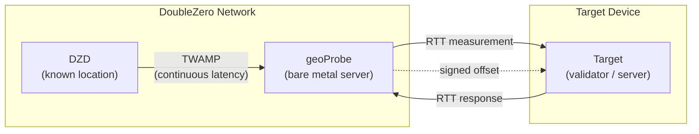
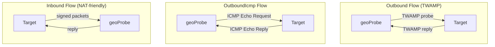

# Geolocalização

O serviço de Geolocalização DoubleZero ajuda os utilizadores a determinar a localização física de dispositivos utilizando medições de latência. As medições de [RTT](glossary.md#rtt-round-trip-time) (round-trip time) entre infraestrutura com localização conhecida e um dispositivo alvo fornecem prova criptograficamente assinada de que um dispositivo se encontra dentro de uma determinada distância de um dado ponto. O registo onchain das medições no DoubleZero Ledger está planeado para uma versão futura.

Os casos de uso incluem conformidade regulatória (e.g., RGPD — provar que validadores operam dentro da UE), auditorias de distribuição geográfica, e qualquer aplicação que necessite de prova verificável de onde um dispositivo ou IP se encontra.

---

## Como funciona {#how-it-works}



O diagrama seguinte mostra os três tipos de fluxo de sonda — Outbound, OutboundIcmp e Inbound — que diferem na forma como o geoProbe comunica com o alvo:



A Geolocalização utiliza uma cadeia de medição de três níveis:

```
DZD (known location) ◄──TWAMP──► geoProbe ◄──RTT──► Target device
```

- **[DZD](glossary.md#dzd-doublezero-device) <-> geoProbe**: O [TWAMP](glossary.md#twamp-two-way-active-measurement-protocol) mede continuamente a latência entre o DoubleZero Device e a sonda. Os DZDs têm coordenadas geográficas conhecidas e fixas registadas no DZ Ledger.
- **geoProbe <-> Alvo**: O RTT é medido entre a sonda e o dispositivo cuja localização está a ser determinada.

Os resultados de offset são criptograficamente assinados e entregues via UDP ao alvo ou a um destino alternativo especificado pelo utilizador.

**Importante:** A Geolocalização reporta apenas RTT — não distância inferida ou coordenadas. Uma forma comum de utilizar isto seria dividir o RTT por 2 e depois multiplicar pela velocidade da luz através do vidro (~200km/ms) para fornecer um raio em torno das coordenadas do DZD dentro do qual o alvo se encontra. Como interpretar o RTT (e.g., calcular um raio de distância máxima) fica ao seu critério.

### Tipos de fluxo de sonda {#probe-flow-types}

Existem três formas de uma sonda medir um alvo:

| Fluxo | Quem inicia | Protocolo | Usar quando |
|-------|-------------|-----------|-------------|
| **Outbound** | Sonda -> Alvo | [TWAMP](glossary.md#twamp-two-way-active-measurement-protocol) | O alvo tem IP público, porta de entrada aberta e pode executar um refletor TWAMP |
| **OutboundIcmp** | Sonda -> Alvo | ICMP echo | O alvo tem IP público mas não pode executar um refletor TWAMP (ou o TWAMP está bloqueado por firewall) |
| **Inbound** | Alvo -> Sonda | TWAMP Assinado | O alvo não consegue aceitar conexões de entrada, ou pretende verificar a localização de uma chave de assinatura |

Em todos os casos, a medição DZD <-> geoProbe acontece da mesma forma. Apenas a direção e o protocolo da comunicação geoProbe <-> alvo diferem.

!!! info "Especificação Técnica"
    Para a especificação técnica completa do sistema de verificação de geolocalização, incluindo detalhes de assinatura criptográfica e o protocolo de medição, consulte [RFC 16: Geolocation Verification](https://github.com/malbeclabs/doublezero/blob/main/rfcs/rfc16-geolocation-verification.md).

---

## Pré-requisitos {#prerequisites}

### 1. DoubleZero ID com créditos {#1-doublezero-id-with-credits}

Os utilizadores de Geolocalização precisam de um DoubleZero ID financiado. Não é necessário conectar-se à rede DoubleZero (não é necessário passe de acesso), mas a sua chave precisa de créditos no DoubleZero ledger para criar uma conta de utilizador e gerir alvos — cada operação de adicionar/remover alvo custa créditos.

Se não tem um DoubleZero ID:

```bash
doublezero keygen
doublezero address   # get your pubkey
```

Contacte a equipa DoubleZero com a sua pubkey para financiar o seu ID. Financie-o com um montante superior ao típico se espera adicionar e remover alvos dinamicamente.

### 2. Conta de token 2Z {#2-2z-token-account}

Precisa de uma conta de [token 2Z](glossary.md#2z-token). As taxas de serviço são deduzidas desta conta numa base por-epoch.

---

## Instalação {#installation}

Num computador de gestão:
```bash
curl -1sLf https://dl.cloudsmith.io/public/malbeclabs/doublezero/setup.deb.sh | sudo -E bash
sudo apt install doublezero
```

Num alvo para Inbound ou TWAMP Outbound:
```bash
curl -1sLf https://dl.cloudsmith.io/public/malbeclabs/doublezero/setup.deb.sh | sudo -E bash
sudo apt install doublezero-geoprobe-target
```
Isto instala o `doublezero-geoprobe-target` (outbound) e o `doublezero-geoprobe-target-sender` (inbound)

!!! note "ICMP Outbound"
    Os alvos `outbound-icmp` não requerem qualquer software instalado.

---

## Verificar o seu saldo {#check-your-balance}

```bash
doublezero balance
```

---

## Configuração {#setup}

### Passo 1: Criar um utilizador de geolocalização {#step-1-create-a-geolocation-user}

```bash
doublezero geolocation user create \
  --env testnet \
  --code <your-user-code> \
  --token-account <your-2Z-token-account>
```

- `--code`: um identificador curto e único para a sua conta (e.g. `myorg`)
- `--token-account`: a chave pública da sua conta de [token 2Z](glossary.md#2z-token) — as taxas de serviço são deduzidas daqui

!!! note "Ativação da conta"
    Após criar um utilizador, contacte a DoubleZero Foundation para ativar a sua conta. O estado de pagamento deve estar marcado como ativo antes do início das sondagens.

### Passo 2: Listar sondas disponíveis {#step-2-list-available-probes}

```bash
doublezero geolocation probe list
```

Anote o **code** ou **public_ip**, e a **signing_pubkey** (para alvos inbound) da sonda que pretende utilizar.

### Passo 3: Adicionar um alvo {#step-3-add-a-target}

=== "Outbound (sonda envia TWAMP para o alvo)"

    Use este fluxo se o seu alvo tem IP público, uma porta de entrada aberta e pode executar um refletor [TWAMP](glossary.md#twamp-two-way-active-measurement-protocol).

    ```bash
    doublezero geolocation user add-target \
      --user <your-user-code> \
      --type outbound \
      --probe <probe-code> \
      --target-ip <target-public-ip>
    ```

    `--probe`: o código do geoProbe que irá medir o alvo (e.g. `ams-mn-gp1`)
    `--ip-address`: o endereço IPv4 público do dispositivo alvo

=== "OutboundIcmp (sonda faz ping ao alvo)"

    Use este fluxo se o seu alvo tem IP público mas não pode executar um refletor TWAMP, ou se o tráfego TWAMP está bloqueado por firewall. O alvo apenas precisa de responder a pedidos ICMP echo (ping) — não é necessário software adicional.

    ```bash
    doublezero geolocation user add-target \
      --user <your-user-code> \
      --type OutboundIcmp \
      --probe <probe-code> \
      --ip-address <target-public-ip>
    ```

    `--probe`: o código do geoProbe que irá medir o alvo (e.g. `ams-mn-gp1`)
    `--ip-address`: o endereço IPv4 público do dispositivo alvo
    !!! Warning "Destino de Resultados"
        Os alvos Outbound ICMP apenas funcionam se o seu utilizador tiver um destino alternativo de resultados definido. (Ver Passo 3b)

=== "Inbound (alvo envia para a sonda)"

    Use este fluxo se o seu alvo está atrás de NAT ou não consegue aceitar conexões de entrada.

    ```bash
    doublezero geolocation user add-target \
      --user <your-user-code> \
      --type inbound \
      --probe <probe-code> \
      --target-pk <target-keypair-pubkey>
    ```

    `--probe`: o código do geoProbe que irá medir o alvo (e.g. `ams-mn-gp1`)
    `--target-pk`: chave pública do par de chaves que o alvo utilizará para assinar mensagens — a sonda apenas aceita mensagens de chaves públicas registadas

### Passo 3b: Definir um destino de resultados (opcional) {#step-3b-set-a-result-destination-optional}

Configure um `host:port` alternativo onde os resultados compostos de LocationOffset são entregues para quaisquer tipos de alvo Outbound. Isto substitui o envio do LocationOffset para o alvo e é configurado por utilizador. Se for necessário um comportamento diferente por alvo, é necessário configurar dois utilizadores, um para cada tipo de comportamento desejado.

O destino alternativo é útil para agregar resultados de múltiplos alvos num único endpoint. É obrigatório para sondagem ICMP.

```bash
doublezero geolocation user set-result-destination \
  --user <your-user-code> \
  --destination <host:port>
```

`--destination`: um endereço IPv4 publicamente roteável ou nome de domínio válido com porta (e.g., `203.0.113.10:9000` ou `results.example.com:9000`). Passe uma string vazia para limpar.

Use `user get` para verificar o seu destino de resultados:

```bash
doublezero geolocation user get --user <your-user-code>
```

### Passo 4: Executar a aplicação no alvo {#step-4-run-the-target-application}

Tanto os fluxos outbound como inbound requerem a execução de uma aplicação no dispositivo alvo. Implementações de referência com exemplos estão disponíveis em Go — pode executá-las diretamente ou utilizá-las como ponto de partida para a sua própria integração.

=== "Outbound"

    Para sondagem outbound, o dispositivo alvo deve executar um refletor [TWAMP](glossary.md#twamp-two-way-active-measurement-protocol) para que o geoProbe possa medir o RTT. Execute a aplicação no alvo no dispositivo a ser medido:

    ```bash
    doublezero-geoprobe-target
    ```

=== "Inbound"

    Para sondagem inbound, o dispositivo alvo deve executar software que envia mensagens assinadas para a sonda.

    No dispositivo a ser medido:

    ```bash
    doublezero-geoprobe-target-sender \
      -probe-ip <probe-ip> \
      -probe-pk <probe-pubkey> \
      -keypair <path-to-keypair.json>
    ```

`-probe-ip`: endereço IP do geoProbe (de `probe list`)
`-probe-pk`: chave pública do geoProbe (de `probe list`)
`-keypair`: caminho para o par de chaves cuja chave pública foi registada como `--target-pk` no Passo 3

O emissor do alvo utiliza um mecanismo de dois pares de sonda: envia duas sondas [TWAMP](glossary.md#twamp-two-way-active-measurement-protocol) pré-assinadas em rápida sucessão. A resposta da sonda ao segundo pacote inclui `SinceLastRxNs` — o tempo entre o envio da resposta 0 pela sonda e a receção da sonda 1 — que serve como o [RTT](glossary.md#rtt-round-trip-time) medido pela sonda. Esta abordagem emparelhada fornece uma medição precisa de RTT mesmo quando o alvo não consegue realizar timestamping preciso ao nível do kernel.

---

## Referência de comandos {#command-reference}

### `doublezero geolocation user` {#doublezero-geolocation-user}

| Subcomando | Descrição |
|------------|-----------|
| `create` | Criar uma nova conta de utilizador de geolocalização |
| `get` | Obter detalhes de um utilizador específico |
| `list` | Listar todos os utilizadores de geolocalização |
| `delete` | Eliminar um utilizador |
| `add-target` | Adicionar um alvo a um utilizador |
| `remove-target` | Remover um alvo de um utilizador |
| `set-result-destination` | Definir um host:port alternativo para entrega de offset |
| `update-payment` | Atualizar estado de pagamento (uso da fundação) |

### `doublezero geolocation probe` {#doublezero-geolocation-probe}

| Subcomando | Descrição |
|------------|-----------|
| `create` | Registar um novo geoProbe |
| `get` | Obter detalhes de uma sonda específica |
| `list` | Listar todas as sondas |
| `update` | Atualizar configuração da sonda |
| `delete` | Eliminar uma sonda |
| `add-parent` | Associar um DZD como pai da sonda |
| `remove-parent` | Remover um DZD pai |

### Flags globais {#global-flags}

| Flag | Descrição |
|------|-----------|
| `--env` | Ambiente de rede: `testnet`, `devnet`, ou `mainnet-beta` |
| `--rpc-url` | Endpoint RPC DoubleZero personalizado |
| `--keypair` | Caminho para o par de chaves de assinatura (obrigatório para operações de escrita) |