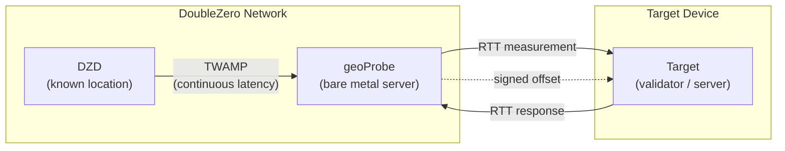
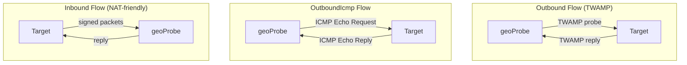

# 地理定位

DoubleZero 地理定位服务帮助用户通过延迟测量确定设备的物理位置。已知位置的基础设施与目标设备之间的 [RTT](glossary.md#rtt-round-trip-time)（往返时间）测量，提供了设备位于给定点一定距离内的加密签名证明。将测量结果记录到 DoubleZero Ledger 的链上功能计划在未来版本中发布。

用例包括法规合规（例如 GDPR — 证明验证者在欧盟境内运行）、地理分布审计，以及任何需要可验证设备或 IP 位置证明的应用。

---

## 工作原理 {#how-it-works}



下图展示了三种探测流类型 — Outbound、OutboundIcmp 和 Inbound — 它们的区别在于 geoProbe 与目标通信的方式：



地理定位使用三层测量链：

```
DZD (known location) ◄──TWAMP──► geoProbe ◄──RTT──► Target device
```

- **[DZD](glossary.md#dzd-doublezero-device) <-> geoProbe**：[TWAMP](glossary.md#twamp-two-way-active-measurement-protocol) 持续测量 DoubleZero Device 与探测器之间的延迟。DZD 具有在 DZ Ledger 上注册的已知固定地理坐标。
- **geoProbe <-> 目标**：测量探测器与被定位设备之间的 RTT。

偏移结果经过加密签名，并通过 UDP 传送到目标或用户指定的备用目的地。

**重要提示：** 地理定位仅报告 RTT — 不报告推断的距离或坐标。常见的使用方式是将 RTT 除以 2，然后乘以光在玻璃中的传播速度（约 200km/ms），从而得到以 DZD 坐标为中心、目标所在的半径范围。如何解释 RTT（例如计算最大距离半径）由您自行决定。

### 探测流类型 {#probe-flow-types}

探测器测量目标有三种方式：

| 流类型 | 发起方 | 协议 | 适用场景 |
|------|---------------|----------|----------|
| **Outbound** | 探测器 -> 目标 | [TWAMP](glossary.md#twamp-two-way-active-measurement-protocol) | 目标有公网 IP、开放入站端口，且能运行 TWAMP 反射器 |
| **OutboundIcmp** | 探测器 -> 目标 | ICMP echo | 目标有公网 IP 但无法运行 TWAMP 反射器（或 TWAMP 被防火墙阻止） |
| **Inbound** | 目标 -> 探测器 | 签名 TWAMP | 目标无法接受入站连接，或需要验证签名密钥的位置 |

在所有情况下，DZD <-> geoProbe 的测量方式相同。只有 geoProbe <-> 目标通信的方向和协议不同。

!!! info "技术规范"
    有关地理定位验证系统的完整技术规范，包括加密签名细节和测量协议，请参阅 [RFC 16: Geolocation Verification](https://github.com/malbeclabs/doublezero/blob/main/rfcs/rfc16-geolocation-verification.md)。

---

## 前提条件 {#prerequisites}

### 1. 拥有额度的 DoubleZero ID {#1-doublezero-id-with-credits}

地理定位用户需要一个已充值的 DoubleZero ID。您不需要连接到 DoubleZero 网络（无需 access pass），但您的密钥需要在 DoubleZero ledger 上有额度才能创建用户账户和管理目标 — 每次添加/删除目标操作都需要消耗额度。

如果您还没有 DoubleZero ID：

```bash
doublezero keygen
doublezero address   # get your pubkey
```

将您的公钥提供给 DoubleZero 团队以获取 ID 充值。如果您预计会动态添加和删除目标，请充值到较高金额。

### 2. 2Z 代币账户 {#2-2z-token-account}

您需要一个 [2Z token](glossary.md#2z-token) 账户。服务费用按每个 epoch 从该账户中扣除。

---

## 安装 {#installation}

在管理计算机上：
```bash
curl -1sLf https://dl.cloudsmith.io/public/malbeclabs/doublezero/setup.deb.sh | sudo -E bash
sudo apt install doublezero
```

在用于 Inbound 或 TWAMP Outbound 的目标设备上：
```bash
curl -1sLf https://dl.cloudsmith.io/public/malbeclabs/doublezero/setup.deb.sh | sudo -E bash
sudo apt install doublezero-geoprobe-target
```
这将安装 `doublezero-geoprobe-target`（outbound）和 `doublezero-geoprobe-target-sender`（inbound）

!!! note "ICMP Outbound"
    `outbound-icmp` 目标不需要安装任何软件。

---

## 查看余额 {#check-your-balance}

```bash
doublezero balance
```

---

## 设置 {#setup}

### 步骤 1：创建地理定位用户 {#step-1-create-a-geolocation-user}

```bash
doublezero geolocation user create \
  --env testnet \
  --code <your-user-code> \
  --token-account <your-2Z-token-account>
```

- `--code`：您账户的简短唯一标识符（例如 `myorg`）
- `--token-account`：您的 [2Z token](glossary.md#2z-token) 账户的公钥 — 服务费用从此处扣除

!!! note "账户激活"
    创建用户后，请联系 DoubleZero Foundation 激活您的账户。在探测开始之前，付款状态必须标记为活跃。

### 步骤 2：列出可用探测器 {#step-2-list-available-probes}

```bash
doublezero geolocation probe list
```

记下您要使用的探测器的 **code** 或 **public_ip**，以及 **signing_pubkey**（用于 inbound 目标）。

### 步骤 3：添加目标 {#step-3-add-a-target}

=== "Outbound（探测器向目标发送 TWAMP）"

    如果您的目标有公网 IP、开放的入站端口，且能运行 [TWAMP](glossary.md#twamp-two-way-active-measurement-protocol) 反射器，请使用此流类型。

    ```bash
    doublezero geolocation user add-target \
      --user <your-user-code> \
      --type outbound \
      --probe <probe-code> \
      --target-ip <target-public-ip>
    ```

    `--probe`：将测量目标的 geoProbe 代码（例如 `ams-mn-gp1`）
    `--ip-address`：目标设备的公网 IPv4 地址

=== "OutboundIcmp（探测器 ping 目标）"

    如果您的目标有公网 IP 但无法运行 TWAMP 反射器，或 TWAMP 流量被防火墙阻止，请使用此流类型。目标只需响应 ICMP echo（ping）请求 — 无需安装额外软件。

    ```bash
    doublezero geolocation user add-target \
      --user <your-user-code> \
      --type OutboundIcmp \
      --probe <probe-code> \
      --ip-address <target-public-ip>
    ```

    `--probe`：将测量目标的 geoProbe 代码（例如 `ams-mn-gp1`）
    `--ip-address`：目标设备的公网 IPv4 地址
    !!! Warning "结果目的地"
        Outbound ICMP 目标仅在您的用户设置了备用结果目的地时才有效。（请参阅步骤 3b）

=== "Inbound（目标向探测器发送）"

    如果您的目标在 NAT 后面或无法接受入站连接，请使用此流类型。

    ```bash
    doublezero geolocation user add-target \
      --user <your-user-code> \
      --type inbound \
      --probe <probe-code> \
      --target-pk <target-keypair-pubkey>
    ```

    `--probe`：将测量目标的 geoProbe 代码（例如 `ams-mn-gp1`）
    `--target-pk`：目标用于签名消息的密钥对的公钥 — 探测器仅接受来自已注册公钥的消息

### 步骤 3b：设置结果目的地（可选） {#step-3b-set-a-result-destination-optional}

为任何 Outbound 目标类型配置备用 `host:port`，用于传送复合 LocationOffset 结果。这将替代向目标发送 LocationOffset，并按用户配置。如果需要不同的按目标行为，则需要设置两个用户，每种所需行为类型各一个。

备用目的地适用于将多个目标的结果聚合到单个端点。对于 ICMP 探测，这是必需的。

```bash
doublezero geolocation user set-result-destination \
  --user <your-user-code> \
  --destination <host:port>
```

`--destination`：可公网路由的 IPv4 地址或带端口的有效域名（例如 `203.0.113.10:9000` 或 `results.example.com:9000`）。传入空字符串可清除设置。

使用 `user get` 验证您的结果目的地：

```bash
doublezero geolocation user get --user <your-user-code>
```

### 步骤 4：运行目标应用程序 {#step-4-run-the-target-application}

Outbound 和 Inbound 流都需要在目标设备上运行应用程序。Go 语言提供了参考实现和示例 — 您可以直接运行或将其作为自行集成的起点。

=== "Outbound"

    对于 outbound 探测，目标设备必须运行 [TWAMP](glossary.md#twamp-two-way-active-measurement-protocol) 反射器，以便 geoProbe 可以测量 RTT。在被测量的设备上运行目标应用程序：

    ```bash
    doublezero-geoprobe-target
    ```

=== "Inbound"

    对于 inbound 探测，目标设备必须运行向探测器发送签名消息的软件。

    在被测量的设备上：

    ```bash
    doublezero-geoprobe-target-sender \
      -probe-ip <probe-ip> \
      -probe-pk <probe-pubkey> \
      -keypair <path-to-keypair.json>
    ```

`-probe-ip`：geoProbe 的 IP 地址（来自 `probe list`）
`-probe-pk`：geoProbe 的公钥（来自 `probe list`）
`-keypair`：其公钥在步骤 3 中注册为 `--target-pk` 的密钥对路径

目标发送器使用双探测对机制：它快速连续发送两个预签名的 [TWAMP](glossary.md#twamp-two-way-active-measurement-protocol) 探测。探测器对第二个数据包的回复中包含 `SinceLastRxNs` — 即探测器发送回复 0 到接收探测 1 之间的时间 — 作为探测器测量的 [RTT](glossary.md#rtt-round-trip-time)。这种配对方法即使在目标无法执行精确的内核级时间戳时也能提供准确的 RTT 测量。

---

## 命令参考 {#command-reference}

### `doublezero geolocation user` {#doublezero-geolocation-user}

| 子命令 | 描述 |
|------------|-------------|
| `create` | 创建新的地理定位用户账户 |
| `get` | 获取特定用户的详细信息 |
| `list` | 列出所有地理定位用户 |
| `delete` | 删除用户 |
| `add-target` | 为用户添加目标 |
| `remove-target` | 从用户中移除目标 |
| `set-result-destination` | 设置偏移传送的备用 host:port |
| `update-payment` | 更新付款状态（foundation 使用） |

### `doublezero geolocation probe` {#doublezero-geolocation-probe}

| 子命令 | 描述 |
|------------|-------------|
| `create` | 注册新的 geoProbe |
| `get` | 获取特定探测器的详细信息 |
| `list` | 列出所有探测器 |
| `update` | 更新探测器配置 |
| `delete` | 删除探测器 |
| `add-parent` | 将 DZD 链接为探测器的父设备 |
| `remove-parent` | 移除父 DZD |

### 全局标志 {#global-flags}

| 标志 | 描述 |
|------|-------------|
| `--env` | 网络环境：`testnet`、`devnet` 或 `mainnet-beta` |
| `--rpc-url` | 自定义 DoubleZero RPC 端点 |
| `--keypair` | 签名密钥对的路径（写操作必需） |