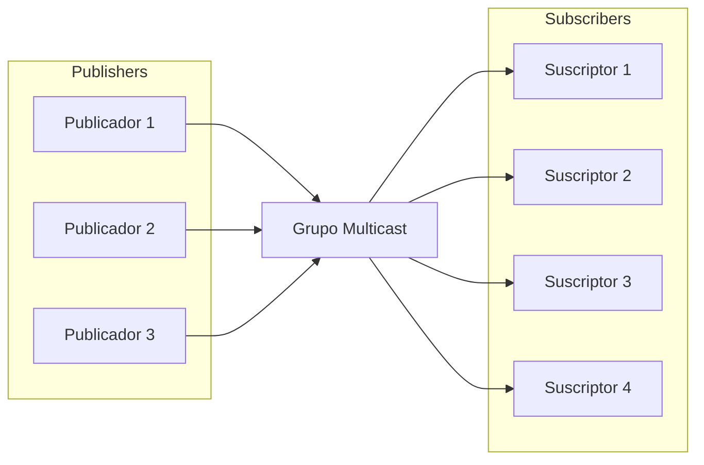

!!! warning "This translation was generated using artificial intelligence and has not been reviewed by a human translator. It may contain inaccuracies or errors and should not be relied upon."

# Gestión de Grupos Multicast en DoubleZero

Un **grupo multicast** es una colección lógica de dispositivos o nodos de red que comparten un identificador común (típicamente una dirección IP multicast) para transmitir datos eficientemente a múltiples destinatarios. A diferencia de la comunicación unicast (uno a uno) o broadcast (uno a todos), el multicast permite a un remitente transmitir un único flujo de datos que es replicado por la red solo para los receptores que se han unido al grupo.

Este enfoque optimiza el uso del ancho de banda y reduce la carga tanto en el remitente como en la infraestructura de red, ya que los paquetes se transmiten solo una vez por enlace y se duplican solo cuando es necesario para llegar a múltiples suscriptores. Los grupos multicast se usan comúnmente en escenarios como transmisión de video en vivo, conferencias, distribución de datos financieros y sistemas de mensajería en tiempo real.

En DoubleZero, los grupos multicast proporcionan un mecanismo seguro y controlado para gestionar quién puede enviar (publicadores) y recibir (suscriptores) datos dentro de cada grupo, garantizando una distribución de información eficiente y gobernada.



El diagrama anterior muestra cómo múltiples usuarios pueden publicar mensajes en un grupo multicast, y múltiples usuarios pueden suscribirse para recibir esos mensajes. La red DoubleZero replica eficientemente los paquetes, asegurando que todos los suscriptores reciban los mensajes sin sobrecarga de transmisión innecesaria.

## 1. Creación y Listado de Grupos Multicast

Los grupos multicast son la base para la distribución segura y eficiente de datos en DoubleZero. Cada grupo se identifica de forma única y se configura con un ancho de banda y propietario específicos. Solo los administradores de la Fundación DoubleZero pueden crear nuevos grupos multicast, garantizando una gobernanza y asignación de recursos adecuadas.

Una vez creados, los grupos multicast pueden listarse para proporcionar una visión general de todos los grupos disponibles, su configuración y su estado actual. Esto es esencial para que los operadores de red y propietarios de grupos monitoreen recursos y gestionen el acceso.

**Creación de un grupo multicast:**

Solo la Fundación DoubleZero puede crear nuevos grupos multicast. El comando de creación requiere un código único, el ancho de banda máximo y la clave pública del propietario (o 'me' para el pagador actual).

```
doublezero multicast group create --code <CODE> --max-bandwidth <MAX_BANDWIDTH> --owner <OWNER>
```

- `--code <CODE>`: Código único para el grupo multicast (por ejemplo, mg01)
- `--max-bandwidth <MAX_BANDWIDTH>`: Ancho de banda máximo para el grupo (por ejemplo, 10Gbps, 100Mbps)
- `--owner <OWNER>`: Clave pública del propietario


**Listar todos los grupos multicast:**

Para listar todos los grupos multicast y ver información resumida (incluyendo el código del grupo, IP multicast, ancho de banda, número de publicadores y suscriptores, estado y propietario):

```
doublezero multicast group list
```

Este comando muestra una tabla con todos los grupos multicast y sus principales propiedades.

Una vez creado un grupo, el propietario puede gestionar qué usuarios pueden conectarse como publicadores o suscriptores.


## 2. Gestión de Listas de Permitidos de Publicadores/Suscriptores

Las listas de permitidos de publicadores y suscriptores son esenciales para controlar el acceso a los grupos multicast en DoubleZero. Estas listas definen explícitamente qué usuarios pueden publicar (enviar datos) o suscribirse (recibir datos) dentro de un grupo multicast específico.

- **Lista de permitidos de publicadores:** Solo los usuarios añadidos a la lista de permitidos de publicadores pueden enviar datos al grupo multicast. Esto garantiza que solo las fuentes autorizadas puedan distribuir información, evitando la publicación no autorizada o maliciosa.
- **Lista de permitidos de suscriptores:** Solo los usuarios presentes en la lista de permitidos de suscriptores pueden suscribirse y recibir datos del grupo multicast. Esto protege el acceso a la información transmitida, asegurando que solo los destinatarios aprobados puedan recibir mensajes.

Gestionar estas listas es responsabilidad del propietario del grupo, quien puede añadir, eliminar o ver publicadores y suscriptores autorizados usando el CLI de DoubleZero.

> **Nota:** Para suscribirse o publicar en un grupo multicast, un usuario debe estar primero autorizado para conectarse a DoubleZero siguiendo los procedimientos de conexión estándar. Los comandos de lista de permitidos descritos aquí solo asocian un usuario DoubleZero ya autorizado con un grupo multicast. Añadir una nueva IP a la lista de permitidos de un grupo multicast no otorga por sí mismo acceso a DoubleZero; el usuario debe haber completado ya el proceso de autorización general antes de interactuar con grupos multicast.


### Añadir un publicador a la lista de permitidos

```
doublezero multicast group allowlist publisher add --code <CODE> --client-ip <CLIENT_IP> --user-payer <USER_PAYER>
```

- `--code <CODE>`: Código del grupo multicast al que añadir el publicador
- `--client-ip <CLIENT_IP>`: Dirección IP del cliente en formato IPv4
- `--user-payer <USER_PAYER>`: Clave pública del publicador o 'me' para el pagador actual


### Eliminar un publicador de la lista de permitidos

```
doublezero multicast group allowlist publisher remove --code <CODE> --client-ip <CLIENT_IP> --user-payer <USER_PAYER>
```

- `--code <CODE>`: Código o pubkey del grupo multicast para eliminar la lista de permitidos del publicador
- `--client-ip <CLIENT_IP>`: Dirección IP del cliente en formato IPv4
- `--user-payer <USER_PAYER>`: Clave pública del publicador o 'me' para el pagador actual


### Listar la lista de permitidos de publicadores de un grupo

Para listar todos los publicadores en la lista de permitidos de un grupo multicast específico, use:

```
doublezero multicast group allowlist publisher list --code <CODE>
```

- `--code <CODE>`: El código del grupo multicast cuya lista de permitidos de publicadores desea ver.

Este comando muestra todos los publicadores actualmente autorizados para conectarse al grupo especificado, incluyendo su cuenta, código de grupo, IP del cliente y pagador de usuario.


### Añadir un suscriptor a la lista de permitidos

```
doublezero multicast group allowlist subscriber add --code <CODE> --client-ip <CLIENT_IP> --user-payer <USER_PAYER>
```

- `--code <CODE>`: Código o pubkey del grupo multicast para añadir la lista de permitidos del suscriptor
- `--client-ip <CLIENT_IP>`: Dirección IP del cliente en formato IPv4
- `--user-payer <USER_PAYER>`: Clave pública del suscriptor o 'me' para el pagador actual


### Eliminar un suscriptor de la lista de permitidos

```
doublezero multicast group allowlist subscriber remove --code <CODE> --client-ip <CLIENT_IP> --user-payer <USER_PAYER>
```

- `--code <CODE>`: Código o pubkey del grupo multicast para eliminar la lista de permitidos del suscriptor
- `--client-ip <CLIENT_IP>`: Dirección IP del cliente en formato IPv4
- `--user-payer <USER_PAYER>`: Clave pública del suscriptor o 'me' para el pagador actual


### Listar la lista de permitidos de suscriptores de un grupo

Para listar todos los suscriptores en la lista de permitidos de un grupo multicast específico, use:

```
doublezero multicast group allowlist subscriber list --code <CODE>
```

- `--code <CODE>`: El código del grupo multicast cuya lista de permitidos de suscriptores desea ver.

Este comando muestra todos los suscriptores actualmente autorizados para conectarse al grupo especificado.

---

Para más información sobre conexión y uso de multicast, consulte [Otras Conexiones Multicast](Other%20Multicast%20Connection.md).
