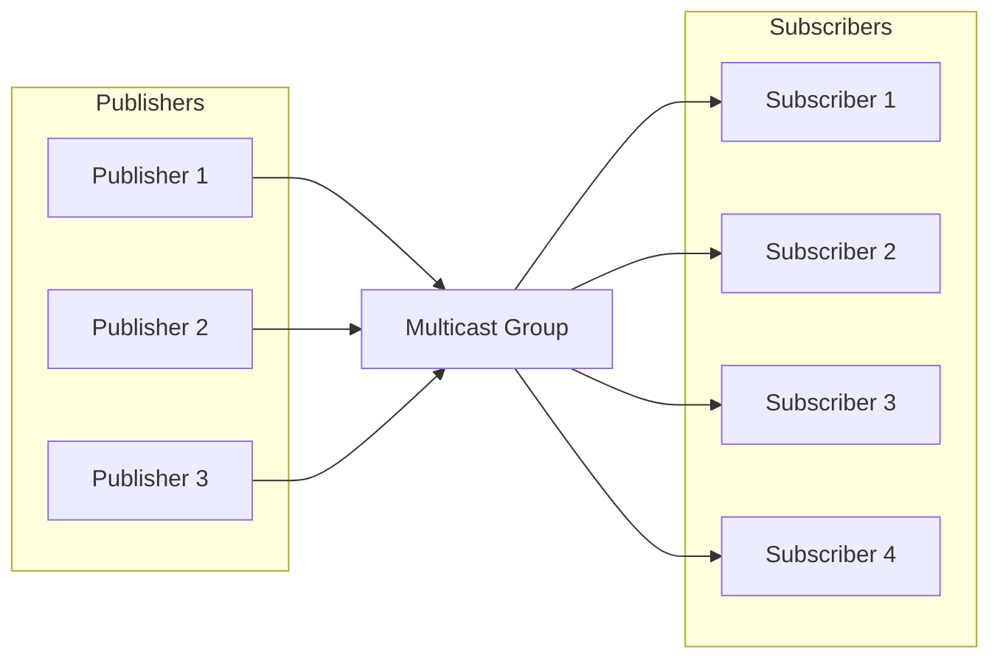

# Gestión de Grupos Multicast en DoubleZero

Un **grupo multicast** es una colección lógica de dispositivos o nodos de red que comparten un identificador común (típicamente una dirección IP multicast) para transmitir datos de manera eficiente a múltiples destinatarios. A diferencia de la comunicación unicast (uno a uno) o broadcast (uno a todos), el multicast permite que un emisor transmita un único flujo de datos que es replicado por la red solo para los receptores que se han unido al grupo.

Este enfoque optimiza el uso del ancho de banda y reduce la carga tanto en el emisor como en la infraestructura de red, ya que los paquetes se transmiten solo una vez por enlace y se duplican únicamente cuando es necesario para alcanzar a múltiples suscriptores. Los grupos multicast se utilizan comúnmente en escenarios como transmisión de video en vivo, conferencias, distribución de datos financieros y sistemas de mensajería en tiempo real.

En DoubleZero, los grupos multicast proporcionan un mecanismo seguro y controlado para gestionar quién puede enviar (publicadores) y recibir (suscriptores) datos dentro de cada grupo, asegurando una distribución de información eficiente y gobernada.


```mermaid
flowchart LR
    subgraph Publishers
        P1[Publisher 1]
        P2[Publisher 2]
        P3[Publisher 3]
    end
    subgraph Subscribers
        S1[Subscriber 1]
        S2[Subscriber 2]
        S3[Subscriber 3]
        S4[Subscriber 4]
    end
    P1 --> B[Multicast Group]
    P2 --> B
    P3 --> B
    B --> S1
    B --> S2
    B --> S3
    B --> S4
```

El diagrama anterior muestra cómo múltiples usuarios pueden publicar mensajes en un grupo multicast, y múltiples usuarios pueden suscribirse para recibir esos mensajes. La red DoubleZero replica eficientemente los paquetes, asegurando que todos los suscriptores reciban los mensajes sin sobrecarga de transmisión innecesaria.

## 1. Creación y Listado de Grupos Multicast

Los grupos multicast son la base para la distribución segura y eficiente de datos en DoubleZero. Cada grupo está identificado de manera única y configurado con un ancho de banda específico y un propietario. Solo los administradores de la DoubleZero Foundation pueden crear nuevos grupos multicast, asegurando una gobernanza y asignación de recursos adecuadas.

Una vez creados, los grupos multicast pueden listarse para proporcionar una visión general de todos los grupos disponibles, su configuración y su estado actual. Esto es esencial para que los operadores de red y los propietarios de grupos monitoreen los recursos y gestionen el acceso.

**Creación de un grupo multicast:**

Solo la DoubleZero Foundation puede crear nuevos grupos multicast. El comando de creación requiere un código único, el ancho de banda máximo y la clave pública del propietario (o 'me' para el pagador actual).

```
doublezero multicast group create --code <CODE> --max-bandwidth <MAX_BANDWIDTH> --owner <OWNER>
```

- `--code <CODE>`: Código único para el grupo multicast (ej., mg01)
- `--max-bandwidth <MAX_BANDWIDTH>`: Ancho de banda máximo para el grupo (ej., 10Gbps, 100Mbps)
- `--owner <OWNER>`: Clave pública del propietario


**Listado de todos los grupos multicast:**

Para listar todos los grupos multicast y ver información resumida (incluyendo código del grupo, IP multicast, ancho de banda, número de publicadores y suscriptores, estado y propietario):

```
doublezero multicast group list
```

Salida de ejemplo:

```
 account                                      | code             | multicast_ip | max_bandwidth | publishers | subscribers | status    | owner
 3eUvZvcpCtsfJ8wqCZvhiyBhbY2Sjn56JcQWpDwsESyX | jito-shredstream | 233.84.178.2 | 200Mbps       | 8          | 0           | activated | 44NdeuZfjhHg61grggBUBpCvPSs96ogXFDo1eRNSKj42
 8ZmH3bx4k1JNYLyEviNAsCFxRoDoG3Y4ntVCUxu24fUF | mg01             | 233.84.178.0 | 1Gbps         | 0          | 0           | activated | DZfHfcCXTLwgZeCRKQ1FL1UuwAwFAZM93g86NMYpfYan
 2CuZeqMrQsrJ4h4PaAuTEpL3ETHQNkSC2XDo66vbDoxw | reserve          | 233.84.178.1 | 100Kbps       | 0          | 0           | activated | DZfPq5hgfwrSB3aKAvcbua9MXE3CABZ233yj6ymncmnd
 4LezgDr5WZs9XNTgajkJYBsUqfJYSd19rCHekNFCcN5D | turbine          | 233.84.178.3 | 1Gbps         | 0          | 4           | activated | DZfHfcCXTLwgZeCRKQ1FL1UuwAwFAZM93g86NMYpfYan
```


Este comando muestra una tabla con todos los grupos multicast y sus propiedades principales:
- `account`: Dirección de la cuenta del grupo
- `code`: Código del grupo multicast
- `multicast_ip`: Dirección IP multicast asignada al grupo
- `max_bandwidth`: Ancho de banda máximo permitido para el grupo
- `publishers`: Número de publicadores en el grupo
- `subscribers`: Número de suscriptores en el grupo
- `status`: Estado actual (ej., activated)
- `owner`: Clave pública del propietario


Una vez que se crea un grupo, el propietario puede gestionar qué usuarios están autorizados para conectarse como publicadores o suscriptores.


## 2. Gestión de Listas de Permitidos de Publicadores/Suscriptores

Las listas de permitidos de publicadores y suscriptores son esenciales para controlar el acceso a los grupos multicast en DoubleZero. Estas listas definen explícitamente qué usuarios están autorizados para publicar (enviar datos) o suscribirse (recibir datos) dentro de un grupo multicast específico.

- **Lista de permitidos de publicadores:** Solo los usuarios añadidos a la lista de permitidos de publicadores pueden enviar datos al grupo multicast. Esto asegura que solo las fuentes autorizadas puedan distribuir información, previniendo la publicación no autorizada o maliciosa.
- **Lista de permitidos de suscriptores:** Solo los usuarios presentes en la lista de permitidos de suscriptores pueden suscribirse y recibir datos del grupo multicast. Esto protege el acceso a la información transmitida, asegurando que solo los destinatarios aprobados puedan recibir mensajes.

La gestión de estas listas es responsabilidad del propietario del grupo, quien puede añadir, eliminar o visualizar los publicadores y suscriptores autorizados utilizando la CLI de DoubleZero. Una gestión adecuada de las listas de permitidos es crítica para mantener la seguridad, integridad y trazabilidad de las comunicaciones multicast.

> **Nota:** Para suscribirse o publicar en un grupo multicast, un usuario debe primero estar autorizado para conectarse a DoubleZero siguiendo los procedimientos estándar de conexión. Los comandos de lista de permitidos descritos aquí solo asocian a un usuario de DoubleZero ya autorizado con un grupo multicast. Añadir una nueva IP a la lista de permitidos de un grupo multicast no otorga por sí mismo acceso a DoubleZero; el usuario debe haber completado previamente el proceso de autorización general antes de interactuar con grupos multicast.


### Añadir un publicador a la lista de permitidos

```
doublezero multicast group allowlist publisher add --code <CODE> --client-ip <CLIENT_IP> --user-payer <USER_PAYER>
```

- `--code <CODE>`: Código del grupo multicast al que añadir el publicador
- `--client-ip <CLIENT_IP>`: Dirección IP del cliente en formato IPv4
- `--user-payer <USER_PAYER>`: Clave pública del publicador o 'me' para el pagador actual


### Eliminar un publicador de la lista de permitidos

```
doublezero multicast group allowlist publisher remove --code <CODE> --client-ip <CLIENT_IP> --user-payer <USER_PAYER>
```

- `--code <CODE>`: Código del grupo multicast o clave pública del cual eliminar la lista de permitidos del publicador
- `--client-ip <CLIENT_IP>`: Dirección IP del cliente en formato IPv4
- `--user-payer <USER_PAYER>`: Clave pública del publicador o 'me' para el pagador actual


### Listar la lista de permitidos de publicadores de un grupo

Para listar todos los publicadores en la lista de permitidos de un grupo multicast específico, utilice:

```
doublezero multicast group allowlist publisher list --code <CODE>
```

- `--code <CODE>`: El código del grupo multicast cuya lista de permitidos de publicadores desea visualizar.

**Ejemplo:**

```
doublezero multicast group allowlist publisher list --code mg01
```

Salida de ejemplo:

```
 account                                      | multicast_group | client_ip       | user_payer
 8ZmH3bx4k1JNYLyEviNAsCFxRoDoG3Y4ntVCUxu24fUF | mg01            | 206.189.166.187 | DZfHfcCXTLwgZeCRKQ1FL1UuwAwFAZM93g86NMYpfYan
 8ZmH3bx4k1JNYLyEviNAsCFxRoDoG3Y4ntVCUxu24fUF | mg01            | 164.92.244.134  | DZfHfcCXTLwgZeCRKQ1FL1UuwAwFAZM93g86NMYpfYan
 8ZmH3bx4k1JNYLyEviNAsCFxRoDoG3Y4ntVCUxu24fUF | mg01            | 186.233.185.50  | DZfHfcCXTLwgZeCRKQ1FL1UuwAwFAZM93g86NMYpfYan
 8ZmH3bx4k1JNYLyEviNAsCFxRoDoG3Y4ntVCUxu24fUF | mg01            | 161.35.58.190   | DZfHfcCXTLwgZeCRKQ1FL1UuwAwFAZM93g86NMYpfYan
 8ZmH3bx4k1JNYLyEviNAsCFxRoDoG3Y4ntVCUxu24fUF | mg01            | 159.223.46.72   | DZfHfcCXTLwgZeCRKQ1FL1UuwAwFAZM93g86NMYpfYan
 8ZmH3bx4k1JNYLyEviNAsCFxRoDoG3Y4ntVCUxu24fUF | mg01            | 204.74.232.130  | DZfHfcCXTLwgZeCRKQ1FL1UuwAwFAZM93g86NMYpfYan
```


Este comando muestra todos los publicadores actualmente autorizados para conectarse al grupo especificado, incluyendo su cuenta, código del grupo, IP del cliente y pagador del usuario.


### Añadir un suscriptor a la lista de permitidos

```
doublezero multicast group allowlist subscriber add --code <CODE> --client-ip <CLIENT_IP> --user-payer <USER_PAYER>
```

- `--code <CODE>`: Código del grupo multicast o clave pública al cual añadir la lista de permitidos del suscriptor
- `--client-ip <CLIENT_IP>`: Dirección IP del cliente en formato IPv4
- `--user-payer <USER_PAYER>`: Clave pública del suscriptor o 'me' para el pagador actual


### Eliminar un suscriptor de la lista de permitidos

```
doublezero multicast group allowlist subscriber remove --code <CODE> --client-ip <CLIENT_IP> --user-payer <USER_PAYER>
```

- `--code <CODE>`: Código del grupo multicast o clave pública del cual eliminar la lista de permitidos del suscriptor
- `--client-ip <CLIENT_IP>`: Dirección IP del cliente en formato IPv4
- `--user-payer <USER_PAYER>`: Clave pública del suscriptor o 'me' para el pagador actual


### Listar la lista de permitidos de suscriptores de un grupo

Para listar todos los suscriptores en la lista de permitidos de un grupo multicast específico, utilice:

```
doublezero multicast group allowlist subscriber list --code <CODE>
```

- `--code <CODE>`: El código del grupo multicast cuya lista de permitidos de suscriptores desea visualizar.

**Ejemplo:**

```
doublezero multicast group allowlist subscriber list --code mg01
```

Salida de ejemplo:

```
 account                                      | multicast_group | client_ip       | user_payer
 8ZmH3bx4k1JNYLyEviNAsCFxRoDoG3Y4ntVCUxu24fUF | mg01            | 186.233.185.50  | DZfHfcCXTLwgZeCRKQ1FL1UuwAwFAZM93g86NMYpfYan
 8ZmH3bx4k1JNYLyEviNAsCFxRoDoG3Y4ntVCUxu24fUF | mg01            | 206.189.166.187 | DZfHfcCXTLwgZeCRKQ1FL1UuwAwFAZM93g86NMYpfYan
 8ZmH3bx4k1JNYLyEviNAsCFxRoDoG3Y4ntVCUxu24fUF | mg01            | 164.92.244.134  | DZfHfcCXTLwgZeCRKQ1FL1UuwAwFAZM93g86NMYpfYan
 8ZmH3bx4k1JNYLyEviNAsCFxRoDoG3Y4ntVCUxu24fUF | mg01            | 204.74.232.130  | DZfHfcCXTLwgZeCRKQ1FL1UuwAwFAZM93g86NMYpfYan
 8ZmH3bx4k1JNYLyEviNAsCFxRoDoG3Y4ntVCUxu24fUF | mg01            | 161.35.58.190   | DZfHfcCXTLwgZeCRKQ1FL1UuwAwFAZM93g86NMYpfYan
 8ZmH3bx4k1JNYLyEviNAsCFxRoDoG3Y4ntVCUxu24fUF | mg01            | 159.223.46.72   | DZfHfcCXTLwgZeCRKQ1FL1UuwAwFAZM93g86NMYpfYan
```


Este comando muestra todos los suscriptores actualmente autorizados para conectarse al grupo especificado, incluyendo su cuenta, código del grupo, IP del cliente y pagador del usuario.

---

Para más información sobre la conexión y uso de multicast, consulte [Otra Conexión Multicast](reference/other-multicast.md).