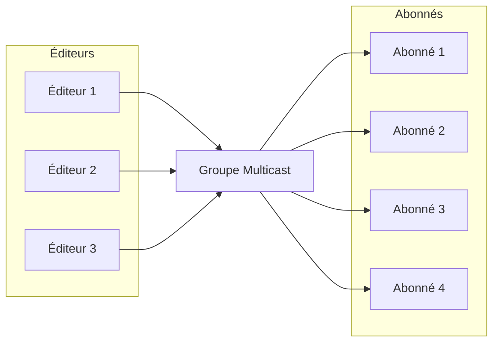

!!! warning "This translation was generated using artificial intelligence and has not been reviewed by a human translator. It may contain inaccuracies or errors and should not be relied upon."

# Gestion des Groupes Multicast dans DoubleZero

Un **groupe multicast** est une collection logique de dispositifs ou de nœuds réseau qui partagent un identifiant commun (généralement une adresse IP multicast) pour transmettre efficacement des données à plusieurs destinataires. Contrairement à la communication unicast (un-vers-un) ou broadcast (un-vers-tous), le multicast permet à un émetteur de transmettre un seul flux de données qui est répliqué par le réseau uniquement pour les récepteurs qui ont rejoint le groupe.

Cette approche optimise l'utilisation de la bande passante et réduit la charge sur l'émetteur et sur l'infrastructure réseau, car les paquets ne sont transmis qu'une seule fois par lien et ne sont dupliqués que lorsque cela est nécessaire pour atteindre plusieurs abonnés. Les groupes multicast sont couramment utilisés dans des scénarios tels que la diffusion vidéo en direct, les conférences, la distribution de données financières et les systèmes de messagerie en temps réel.

Dans DoubleZero, les groupes multicast fournissent un mécanisme sécurisé et contrôlé pour gérer qui peut envoyer (éditeurs) et recevoir (abonnés) des données au sein de chaque groupe, assurant une distribution d'informations efficace et gouvernée.



Le diagramme ci-dessus montre comment plusieurs utilisateurs peuvent publier des messages vers un groupe multicast, et plusieurs utilisateurs peuvent s'abonner pour recevoir ces messages. Le réseau DoubleZero réplique efficacement les paquets, s'assurant que tous les abonnés reçoivent les messages sans surcharge de transmission inutile.

## 1. Création et Liste des Groupes Multicast

Les groupes multicast sont la base d'une distribution de données sécurisée et efficace dans DoubleZero. Chaque groupe est identifié de manière unique et configuré avec une bande passante et un propriétaire spécifiques. Seuls les administrateurs de la DoubleZero Foundation peuvent créer de nouveaux groupes multicast, assurant une bonne gouvernance et une allocation appropriée des ressources.

Une fois créés, les groupes multicast peuvent être listés pour fournir un aperçu de tous les groupes disponibles, de leur configuration et de leur statut actuel. Ceci est essentiel pour que les opérateurs réseau et les propriétaires de groupes puissent surveiller les ressources et gérer les accès.

**Création d'un groupe multicast :**

Seule la DoubleZero Foundation peut créer de nouveaux groupes multicast. La commande de création nécessite un code unique, la bande passante maximale et la clé publique du propriétaire (ou 'me' pour le payeur actuel).

```
doublezero multicast group create --code <CODE> --max-bandwidth <MAX_BANDWIDTH> --owner <OWNER>
```

- `--code <CODE>` : Code unique pour le groupe multicast (p. ex., mg01)
- `--max-bandwidth <MAX_BANDWIDTH>` : Bande passante maximale pour le groupe (p. ex., 10Gbps, 100Mbps)
- `--owner <OWNER>` : Clé publique du propriétaire


**Liste de tous les groupes multicast :**

Pour lister tous les groupes multicast et afficher les informations récapitulatives (y compris le code du groupe, l'IP multicast, la bande passante, le nombre d'éditeurs et d'abonnés, le statut et le propriétaire) :

```
doublezero multicast group list
```

Exemple de sortie :

```
 account                                      | code             | multicast_ip | max_bandwidth | publishers | subscribers | status    | owner
 3eUvZvcpCtsfJ8wqCZvhiyBhbY2Sjn56JcQWpDwsESyX | jito-shredstream | 233.84.178.2 | 200Mbps       | 8          | 0           | activated | 44NdeuZfjhHg61grggBUBpCvPSs96ogXFDo1eRNSKj42
 8ZmH3bx4k1JNYLyEviNAsCFxRoDoG3Y4ntVCUxu24fUF | mg01             | 233.84.178.0 | 1Gbps         | 0          | 0           | activated | DZfHfcCXTLwgZeCRKQ1FL1UuwAwFAZM93g86NMYpfYan
 2CuZeqMrQsrJ4h4PaAuTEpL3ETHQNkSC2XDo66vbDoxw | reserve          | 233.84.178.1 | 100Kbps       | 0          | 0           | activated | DZfPq5hgfwrSB3aKAvcbua9MXE3CABZ233yj6ymncmnd
 4LezgDr5WZs9XNTgajkJYBsUqfJYSd19rCHekNFCcN5D | turbine          | 233.84.178.3 | 1Gbps         | 0          | 4           | activated | DZfHfcCXTLwgZeCRKQ1FL1UuwAwFAZM93g86NMYpfYan
```


Cette commande affiche un tableau avec tous les groupes multicast et leurs principales propriétés :
- `account` : Adresse du compte du groupe
- `code` : Code du groupe multicast
- `multicast_ip` : Adresse IP multicast attribuée au groupe
- `max_bandwidth` : Bande passante maximale autorisée pour le groupe
- `publishers` : Nombre d'éditeurs dans le groupe
- `subscribers` : Nombre d'abonnés dans le groupe
- `status` : Statut actuel (p. ex., activé)
- `owner` : Clé publique du propriétaire


Une fois qu'un groupe est créé, le propriétaire peut gérer quels utilisateurs sont autorisés à se connecter en tant qu'éditeurs ou abonnés.


## 2. Gestion des Listes d'Autorisation Éditeur/Abonné

Les listes d'autorisation des éditeurs et des abonnés sont essentielles pour contrôler l'accès aux groupes multicast dans DoubleZero. Ces listes définissent explicitement quels utilisateurs sont autorisés à publier (envoyer des données) ou à s'abonner (recevoir des données) au sein d'un groupe multicast spécifique.

- **Liste d'autorisation des éditeurs :** Seuls les utilisateurs ajoutés à la liste d'autorisation des éditeurs peuvent envoyer des données au groupe multicast. Cela garantit que seules les sources autorisées peuvent distribuer des informations, empêchant toute publication non autorisée ou malveillante.
- **Liste d'autorisation des abonnés :** Seuls les utilisateurs présents dans la liste d'autorisation des abonnés peuvent s'abonner et recevoir des données du groupe multicast. Cela protège l'accès aux informations transmises, s'assurant que seuls les destinataires approuvés peuvent recevoir les messages.

La gestion de ces listes est la responsabilité du propriétaire du groupe, qui peut ajouter, supprimer ou consulter les éditeurs et abonnés autorisés à l'aide de la CLI DoubleZero. Une gestion appropriée des listes d'autorisation est essentielle pour maintenir la sécurité, l'intégrité et la traçabilité des communications multicast.

> **Note :** Pour s'abonner ou publier dans un groupe multicast, un utilisateur doit d'abord être autorisé à se connecter à DoubleZero en suivant les procédures de connexion standard. Les commandes de liste d'autorisation décrites ici associent uniquement un utilisateur DoubleZero déjà autorisé à un groupe multicast. L'ajout d'une nouvelle IP à la liste d'autorisation d'un groupe multicast n'accorde pas par lui-même l'accès à DoubleZero ; l'utilisateur doit avoir déjà complété le processus d'autorisation général avant d'interagir avec les groupes multicast.


### Ajouter un éditeur à la liste d'autorisation

```
doublezero multicast group allowlist publisher add --code <CODE> --client-ip <CLIENT_IP> --user-payer <USER_PAYER>
```

- `--code <CODE>` : Code du groupe multicast auquel ajouter l'éditeur
- `--client-ip <CLIENT_IP>` : Adresse IP du client au format IPv4
- `--user-payer <USER_PAYER>` : Clé publique de l'éditeur ou 'me' pour le payeur actuel


### Supprimer un éditeur de la liste d'autorisation

```
doublezero multicast group allowlist publisher remove --code <CODE> --client-ip <CLIENT_IP> --user-payer <USER_PAYER>
```

- `--code <CODE>` : Code ou clé publique du groupe multicast pour lequel supprimer la liste d'autorisation de l'éditeur
- `--client-ip <CLIENT_IP>` : Adresse IP du client au format IPv4
- `--user-payer <USER_PAYER>` : Clé publique de l'éditeur ou 'me' pour le payeur actuel


### Lister la liste d'autorisation des éditeurs pour un groupe

Pour lister tous les éditeurs dans la liste d'autorisation d'un groupe multicast spécifique, utilisez :

```
doublezero multicast group allowlist publisher list --code <CODE>
```

- `--code <CODE>` : Le code du groupe multicast dont vous souhaitez consulter la liste d'autorisation des éditeurs.

**Exemple :**

```
doublezero multicast group allowlist publisher list --code mg01
```

Exemple de sortie :

```
 account                                      | multicast_group | client_ip       | user_payer
 8ZmH3bx4k1JNYLyEviNAsCFxRoDoG3Y4ntVCUxu24fUF | mg01            | 206.189.166.187 | DZfHfcCXTLwgZeCRKQ1FL1UuwAwFAZM93g86NMYpfYan
 8ZmH3bx4k1JNYLyEviNAsCFxRoDoG3Y4ntVCUxu24fUF | mg01            | 164.92.244.134  | DZfHfcCXTLwgZeCRKQ1FL1UuwAwFAZM93g86NMYpfYan
 8ZmH3bx4k1JNYLyEviNAsCFxRoDoG3Y4ntVCUxu24fUF | mg01            | 186.233.185.50  | DZfHfcCXTLwgZeCRKQ1FL1UuwAwFAZM93g86NMYpfYan
 8ZmH3bx4k1JNYLyEviNAsCFxRoDoG3Y4ntVCUxu24fUF | mg01            | 161.35.58.190   | DZfHfcCXTLwgZeCRKQ1FL1UuwAwFAZM93g86NMYpfYan
 8ZmH3bx4k1JNYLyEviNAsCFxRoDoG3Y4ntVCUxu24fUF | mg01            | 159.223.46.72   | DZfHfcCXTLwgZeCRKQ1FL1UuwAwFAZM93g86NMYpfYan
 8ZmH3bx4k1JNYLyEviNAsCFxRoDoG3Y4ntVCUxu24fUF | mg01            | 204.74.232.130  | DZfHfcCXTLwgZeCRKQ1FL1UuwAwFAZM93g86NMYpfYan
```


Cette commande affiche tous les éditeurs actuellement autorisés à se connecter au groupe spécifié, y compris leur compte, le code du groupe, l'IP du client et le payeur utilisateur.


### Ajouter un abonné à la liste d'autorisation

```
doublezero multicast group allowlist subscriber add --code <CODE> --client-ip <CLIENT_IP> --user-payer <USER_PAYER>
```

- `--code <CODE>` : Code ou clé publique du groupe multicast pour lequel ajouter la liste d'autorisation de l'abonné
- `--client-ip <CLIENT_IP>` : Adresse IP du client au format IPv4
- `--user-payer <USER_PAYER>` : Clé publique de l'abonné ou 'me' pour le payeur actuel


### Supprimer un abonné de la liste d'autorisation

```
doublezero multicast group allowlist subscriber remove --code <CODE> --client-ip <CLIENT_IP> --user-payer <USER_PAYER>
```

- `--code <CODE>` : Code ou clé publique du groupe multicast pour lequel supprimer la liste d'autorisation de l'abonné
- `--client-ip <CLIENT_IP>` : Adresse IP du client au format IPv4
- `--user-payer <USER_PAYER>` : Clé publique de l'abonné ou 'me' pour le payeur actuel


### Lister la liste d'autorisation des abonnés pour un groupe

Pour lister tous les abonnés dans la liste d'autorisation d'un groupe multicast spécifique, utilisez :

```
doublezero multicast group allowlist subscriber list --code <CODE>
```

- `--code <CODE>` : Le code du groupe multicast dont vous souhaitez consulter la liste d'autorisation des abonnés.

**Exemple :**

```
doublezero multicast group allowlist subscriber list --code mg01
```

Exemple de sortie :

```
 account                                      | multicast_group | client_ip       | user_payer
 8ZmH3bx4k1JNYLyEviNAsCFxRoDoG3Y4ntVCUxu24fUF | mg01            | 186.233.185.50  | DZfHfcCXTLwgZeCRKQ1FL1UuwAwFAZM93g86NMYpfYan
 8ZmH3bx4k1JNYLyEviNAsCFxRoDoG3Y4ntVCUxu24fUF | mg01            | 206.189.166.187 | DZfHfcCXTLwgZeCRKQ1FL1UuwAwFAZM93g86NMYpfYan
 8ZmH3bx4k1JNYLyEviNAsCFxRoDoG3Y4ntVCUxu24fUF | mg01            | 164.92.244.134  | DZfHfcCXTLwgZeCRKQ1FL1UuwAwFAZM93g86NMYpfYan
 8ZmH3bx4k1JNYLyEviNAsCFxRoDoG3Y4ntVCUxu24fUF | mg01            | 204.74.232.130  | DZfHfcCXTLwgZeCRKQ1FL1UuwAwFAZM93g86NMYpfYan
 8ZmH3bx4k1JNYLyEviNAsCFxRoDoG3Y4ntVCUxu24fUF | mg01            | 161.35.58.190   | DZfHfcCXTLwgZeCRKQ1FL1UuwAwFAZM93g86NMYpfYan
 8ZmH3bx4k1JNYLyEviNAsCFxRoDoG3Y4ntVCUxu24fUF | mg01            | 159.223.46.72   | DZfHfcCXTLwgZeCRKQ1FL1UuwAwFAZM93g86NMYpfYan
```


Cette commande affiche tous les abonnés actuellement autorisés à se connecter au groupe spécifié, y compris leur compte, le code du groupe, l'IP du client et le payeur utilisateur.

---

Pour plus d'informations sur la connexion et l'utilisation du multicast, consultez [Autre Connexion Multicast](Other%20Multicast%20Connection.md).
