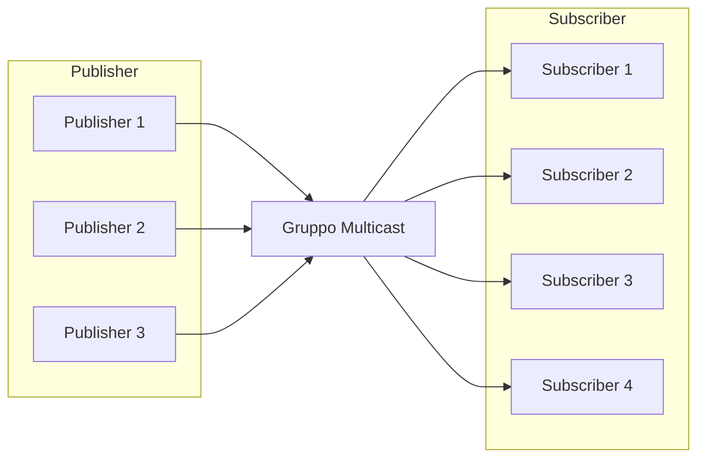

!!! warning "This translation was generated using artificial intelligence and has not been reviewed by a human translator. It may contain inaccuracies or errors and should not be relied upon."

# Gestione dei Gruppi Multicast in DoubleZero

Un **gruppo multicast** è una raccolta logica di dispositivi o nodi di rete che condividono un identificatore comune (tipicamente un indirizzo IP multicast) per trasmettere in modo efficiente i dati a più destinatari. A differenza della comunicazione unicast (uno-a-uno) o broadcast (uno-a-tutti), il multicast consente a un mittente di trasmettere un singolo flusso di dati che viene replicato dalla rete solo per i ricevitori che si sono uniti al gruppo.

Questo approccio ottimizza l'utilizzo della larghezza di banda e riduce il carico sia sul mittente che sull'infrastruttura di rete, poiché i pacchetti vengono trasmessi una sola volta per link e duplicati solo quando necessario per raggiungere più subscriber. I gruppi multicast sono comunemente utilizzati in scenari come lo streaming video in diretta, le conferenze, la distribuzione di dati finanziari e i sistemi di messaggistica in tempo reale.

In DoubleZero, i gruppi multicast forniscono un meccanismo sicuro e controllato per gestire chi può inviare (publisher) e ricevere (subscriber) dati all'interno di ciascun gruppo, garantendo una distribuzione delle informazioni efficiente e governata.



Il diagramma sopra mostra come più utenti possono pubblicare messaggi in un gruppo multicast e come più utenti possono sottoscrivere per ricevere quei messaggi. La rete DoubleZero replica efficientemente i pacchetti, garantendo che tutti i subscriber ricevano i messaggi senza inutile overhead di trasmissione.

## 1. Creazione e Visualizzazione dei Gruppi Multicast

I gruppi multicast sono la base per la distribuzione sicura ed efficiente dei dati in DoubleZero. Ogni gruppo è identificato in modo univoco e configurato con una larghezza di banda specifica e un proprietario. Solo gli amministratori della DoubleZero Foundation possono creare nuovi gruppi multicast, garantendo una corretta governance e allocazione delle risorse.

Una volta creati, i gruppi multicast possono essere elencati per fornire una panoramica di tutti i gruppi disponibili, della loro configurazione e del loro stato attuale. Questo è essenziale per gli operatori di rete e i proprietari dei gruppi per monitorare le risorse e gestire gli accessi.

**Creazione di un gruppo multicast:**

Solo la DoubleZero Foundation può creare nuovi gruppi multicast. Il comando di creazione richiede un codice univoco, la larghezza di banda massima e la chiave pubblica del proprietario (o 'me' per il pagante corrente).

```
doublezero multicast group create --code <CODE> --max-bandwidth <MAX_BANDWIDTH> --owner <OWNER>
```

- `--code <CODE>`: Codice univoco per il gruppo multicast (es. mg01)
- `--max-bandwidth <MAX_BANDWIDTH>`: Larghezza di banda massima per il gruppo (es. 10Gbps, 100Mbps)
- `--owner <OWNER>`: Chiave pubblica del proprietario


**Elenco di tutti i gruppi multicast:**

Per elencare tutti i gruppi multicast e visualizzare le informazioni di riepilogo (inclusi codice gruppo, IP multicast, larghezza di banda, numero di publisher e subscriber, stato e proprietario):

```
doublezero multicast group list
```

Esempio di output:

```
 account                                      | code             | multicast_ip | max_bandwidth | publishers | subscribers | status    | owner
 3eUvZvcpCtsfJ8wqCZvhiyBhbY2Sjn56JcQWpDwsESyX | jito-shredstream | 233.84.178.2 | 200Mbps       | 8          | 0           | activated | 44NdeuZfjhHg61grggBUBpCvPSs96ogXFDo1eRNSKj42
 8ZmH3bx4k1JNYLyEviNAsCFxRoDoG3Y4ntVCUxu24fUF | mg01             | 233.84.178.0 | 1Gbps         | 0          | 0           | activated | DZfHfcCXTLwgZeCRKQ1FL1UuwAwFAZM93g86NMYpfYan
 2CuZeqMrQsrJ4h4PaAuTEpL3ETHQNkSC2XDo66vbDoxw | reserve          | 233.84.178.1 | 100Kbps       | 0          | 0           | activated | DZfPq5hgfwrSB3aKAvcbua9MXE3CABZ233yj6ymncmnd
 4LezgDr5WZs9XNTgajkJYBsUqfJYSd19rCHekNFCcN5D | turbine          | 233.84.178.3 | 1Gbps         | 0          | 4           | activated | DZfHfcCXTLwgZeCRKQ1FL1UuwAwFAZM93g86NMYpfYan
```


Questo comando mostra una tabella con tutti i gruppi multicast e le loro principali proprietà:
- `account`: Indirizzo account del gruppo
- `code`: Codice del gruppo multicast
- `multicast_ip`: Indirizzo IP multicast assegnato al gruppo
- `max_bandwidth`: Larghezza di banda massima consentita per il gruppo
- `publishers`: Numero di publisher nel gruppo
- `subscribers`: Numero di subscriber nel gruppo
- `status`: Stato attuale (es. activated)
- `owner`: Chiave pubblica del proprietario


Una volta creato un gruppo, il proprietario può gestire quali utenti sono autorizzati a connettersi come publisher o subscriber.


## 2. Gestione delle Allowlist Publisher/Subscriber

Le allowlist di publisher e subscriber sono essenziali per controllare l'accesso ai gruppi multicast in DoubleZero. Queste liste definiscono esplicitamente quali utenti sono autorizzati a pubblicare (inviare dati) o sottoscrivere (ricevere dati) all'interno di un gruppo multicast specifico.

- **Allowlist publisher:** Solo gli utenti aggiunti all'allowlist publisher possono inviare dati al gruppo multicast. Ciò garantisce che solo le sorgenti autorizzate possano distribuire informazioni, prevenendo pubblicazioni non autorizzate o malevole.
- **Allowlist subscriber:** Solo gli utenti presenti nell'allowlist subscriber possono sottoscrivere e ricevere dati dal gruppo multicast. Questo protegge l'accesso alle informazioni trasmesse, garantendo che solo i destinatari approvati possano ricevere i messaggi.

La gestione di queste liste è responsabilità del proprietario del gruppo, che può aggiungere, rimuovere o visualizzare publisher e subscriber autorizzati usando la CLI DoubleZero. Una corretta gestione delle allowlist è fondamentale per mantenere la sicurezza, l'integrità e la tracciabilità delle comunicazioni multicast.

> **Nota:** Per sottoscrivere o pubblicare in un gruppo multicast, un utente deve prima essere autorizzato a connettersi a DoubleZero seguendo le procedure di connessione standard. I comandi allowlist descritti qui associano solo un utente DoubleZero già autorizzato a un gruppo multicast. L'aggiunta di un nuovo IP all'allowlist di un gruppo multicast non concede di per sé l'accesso a DoubleZero; l'utente deve aver già completato il processo di autorizzazione generale prima di interagire con i gruppi multicast.


### Aggiunta di un publisher all'allowlist

```
doublezero multicast group allowlist publisher add --code <CODE> --client-ip <CLIENT_IP> --user-payer <USER_PAYER>
```

- `--code <CODE>`: Codice del gruppo multicast a cui aggiungere il publisher
- `--client-ip <CLIENT_IP>`: Indirizzo IP client in formato IPv4
- `--user-payer <USER_PAYER>`: Chiave pubblica del publisher o 'me' per il pagante corrente


### Rimozione di un publisher dall'allowlist

```
doublezero multicast group allowlist publisher remove --code <CODE> --client-ip <CLIENT_IP> --user-payer <USER_PAYER>
```

- `--code <CODE>`: Codice o pubkey del gruppo multicast per cui rimuovere l'allowlist publisher
- `--client-ip <CLIENT_IP>`: Indirizzo IP client in formato IPv4
- `--user-payer <USER_PAYER>`: Chiave pubblica del publisher o 'me' per il pagante corrente


### Visualizzazione dell'allowlist publisher per un gruppo

Per elencare tutti i publisher nell'allowlist per un gruppo multicast specifico, usa:

```
doublezero multicast group allowlist publisher list --code <CODE>
```

- `--code <CODE>`: Il codice del gruppo multicast di cui vuoi visualizzare l'allowlist publisher.

**Esempio:**

```
doublezero multicast group allowlist publisher list --code mg01
```

Esempio di output:

```
 account                                      | multicast_group | client_ip       | user_payer
 8ZmH3bx4k1JNYLyEviNAsCFxRoDoG3Y4ntVCUxu24fUF | mg01            | 206.189.166.187 | DZfHfcCXTLwgZeCRKQ1FL1UuwAwFAZM93g86NMYpfYan
 8ZmH3bx4k1JNYLyEviNAsCFxRoDoG3Y4ntVCUxu24fUF | mg01            | 164.92.244.134  | DZfHfcCXTLwgZeCRKQ1FL1UuwAwFAZM93g86NMYpfYan
 8ZmH3bx4k1JNYLyEviNAsCFxRoDoG3Y4ntVCUxu24fUF | mg01            | 186.233.185.50  | DZfHfcCXTLwgZeCRKQ1FL1UuwAwFAZM93g86NMYpfYan
 8ZmH3bx4k1JNYLyEviNAsCFxRoDoG3Y4ntVCUxu24fUF | mg01            | 161.35.58.190   | DZfHfcCXTLwgZeCRKQ1FL1UuwAwFAZM93g86NMYpfYan
 8ZmH3bx4k1JNYLyEviNAsCFxRoDoG3Y4ntVCUxu24fUF | mg01            | 159.223.46.72   | DZfHfcCXTLwgZeCRKQ1FL1UuwAwFAZM93g86NMYpfYan
 8ZmH3bx4k1JNYLyEviNAsCFxRoDoG3Y4ntVCUxu24fUF | mg01            | 204.74.232.130  | DZfHfcCXTLwgZeCRKQ1FL1UuwAwFAZM93g86NMYpfYan
```


Questo comando mostra tutti i publisher attualmente autorizzati a connettersi al gruppo specificato, inclusi il loro account, codice gruppo, IP client e pagante utente.


### Aggiunta di un subscriber all'allowlist

```
doublezero multicast group allowlist subscriber add --code <CODE> --client-ip <CLIENT_IP> --user-payer <USER_PAYER>
```

- `--code <CODE>`: Codice o pubkey del gruppo multicast per cui aggiungere l'allowlist subscriber
- `--client-ip <CLIENT_IP>`: Indirizzo IP client in formato IPv4
- `--user-payer <USER_PAYER>`: Chiave pubblica del subscriber o 'me' per il pagante corrente


### Rimozione di un subscriber dall'allowlist

```
doublezero multicast group allowlist subscriber remove --code <CODE> --client-ip <CLIENT_IP> --user-payer <USER_PAYER>
```

- `--code <CODE>`: Codice o pubkey del gruppo multicast per cui rimuovere l'allowlist subscriber
- `--client-ip <CLIENT_IP>`: Indirizzo IP client in formato IPv4
- `--user-payer <USER_PAYER>`: Chiave pubblica del subscriber o 'me' per il pagante corrente


### Visualizzazione dell'allowlist subscriber per un gruppo

Per elencare tutti i subscriber nell'allowlist per un gruppo multicast specifico, usa:

```
doublezero multicast group allowlist subscriber list --code <CODE>
```

- `--code <CODE>`: Il codice del gruppo multicast di cui vuoi visualizzare l'allowlist subscriber.

**Esempio:**

```
doublezero multicast group allowlist subscriber list --code mg01
```

Esempio di output:

```
 account                                      | multicast_group | client_ip       | user_payer
 8ZmH3bx4k1JNYLyEviNAsCFxRoDoG3Y4ntVCUxu24fUF | mg01            | 186.233.185.50  | DZfHfcCXTLwgZeCRKQ1FL1UuwAwFAZM93g86NMYpfYan
 8ZmH3bx4k1JNYLyEviNAsCFxRoDoG3Y4ntVCUxu24fUF | mg01            | 206.189.166.187 | DZfHfcCXTLwgZeCRKQ1FL1UuwAwFAZM93g86NMYpfYan
 8ZmH3bx4k1JNYLyEviNAsCFxRoDoG3Y4ntVCUxu24fUF | mg01            | 164.92.244.134  | DZfHfcCXTLwgZeCRKQ1FL1UuwAwFAZM93g86NMYpfYan
 8ZmH3bx4k1JNYLyEviNAsCFxRoDoG3Y4ntVCUxu24fUF | mg01            | 204.74.232.130  | DZfHfcCXTLwgZeCRKQ1FL1UuwAwFAZM93g86NMYpfYan
 8ZmH3bx4k1JNYLyEviNAsCFxRoDoG3Y4ntVCUxu24fUF | mg01            | 161.35.58.190   | DZfHfcCXTLwgZeCRKQ1FL1UuwAwFAZM93g86NMYpfYan
 8ZmH3bx4k1JNYLyEviNAsCFxRoDoG3Y4ntVCUxu24fUF | mg01            | 159.223.46.72   | DZfHfcCXTLwgZeCRKQ1FL1UuwAwFAZM93g86NMYpfYan
```


Questo comando mostra tutti i subscriber attualmente autorizzati a connettersi al gruppo specificato, inclusi il loro account, codice gruppo, IP client e pagante utente.

---

Per ulteriori informazioni sulla connessione e l'utilizzo del multicast, consulta [Altra Connessione Multicast](Other%20Multicast%20Connection.md).
