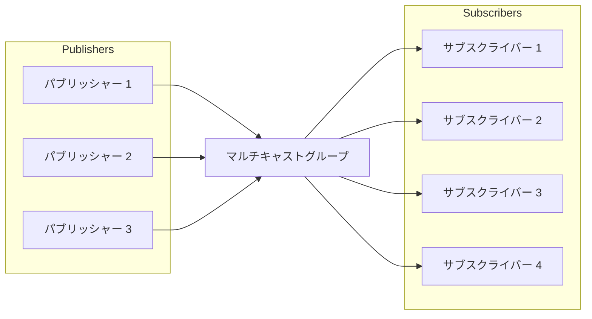

# DoubleZeroにおけるマルチキャストグループ管理

**マルチキャストグループ**は、データを複数の受信者に効率的に送信するために共通の識別子（通常はマルチキャストIPアドレス）を共有するデバイスやネットワークノードの論理的な集合体です。ユニキャスト（1対1）やブロードキャスト（1対全）通信とは異なり、マルチキャストではグループに参加した受信者に対してのみ、ネットワークによって複製される単一のデータストリームを送信者が送信できます。

このアプローチにより、パケットはリンクごとに1度だけ送信され、複数のサブスクライバーに到達するために必要な場合にのみ複製されるため、帯域幅の使用を最適化し、送信者とネットワークインフラの両方への負荷を軽減します。マルチキャストグループは、ライブビデオストリーミング、会議、金融データ配信、リアルタイムメッセージングシステムなどのシナリオで一般的に使用されます。

DoubleZeroでは、マルチキャストグループは各グループ内でデータを送信（パブリッシャー）および受信（サブスクライバー）できるユーザーを管理するための安全で制御されたメカニズムを提供し、効率的でガバナンスされた情報配信を確保します。



上の図は、複数のユーザーがマルチキャストグループにメッセージをパブリッシュでき、複数のユーザーがそれらのメッセージを受信するためにサブスクライブできることを示しています。DoubleZeroネットワークはパケットを効率的に複製し、すべてのサブスクライバーが不要な送信オーバーヘッドなしにメッセージを受信できるようにします。

## 1. マルチキャストグループの作成と一覧表示

マルチキャストグループはDoubleZeroにおける安全で効率的なデータ配信の基盤です。各グループは一意に識別され、特定の帯域幅とオーナーで設定されます。新しいマルチキャストグループを作成できるのはDoubleZero Foundation管理者のみであり、適切なガバナンスとリソース割り当てが確保されます。

作成後、マルチキャストグループを一覧表示して、利用可能なすべてのグループ、その設定、現在のステータスの概要を確認できます。これはネットワークオペレーターとグループオーナーがリソースを監視してアクセスを管理するために不可欠です。

**マルチキャストグループの作成：**

新しいマルチキャストグループはDoubleZero Foundationのみが作成できます。作成コマンドには一意のコード、最大帯域幅、オーナーの公開鍵（または現在のペイヤーのための「me」）が必要です。

```
doublezero multicast group create --code <CODE> --max-bandwidth <MAX_BANDWIDTH> --owner <OWNER>
```

- `--code <CODE>`：マルチキャストグループの一意のコード（例：mg01）
- `--max-bandwidth <MAX_BANDWIDTH>`：グループの最大帯域幅（例：10Gbps、100Mbps）
- `--owner <OWNER>`：オーナーの公開鍵


**すべてのマルチキャストグループの一覧表示：**

すべてのマルチキャストグループを一覧表示し、要約情報（グループコード、マルチキャストIP、帯域幅、パブリッシャーとサブスクライバーの数、ステータス、オーナーを含む）を表示するには：

```
doublezero multicast group list
```

サンプル出力：

```
 account                                      | code             | multicast_ip | max_bandwidth | publishers | subscribers | status    | owner
 3eUvZvcpCtsfJ8wqCZvhiyBhbY2Sjn56JcQWpDwsESyX | jito-shredstream | 233.84.178.2 | 200Mbps       | 8          | 0           | activated | 44NdeuZfjhHg61grggBUBpCvPSs96ogXFDo1eRNSKj42
 8ZmH3bx4k1JNYLyEviNAsCFxRoDoG3Y4ntVCUxu24fUF | mg01             | 233.84.178.0 | 1Gbps         | 0          | 0           | activated | DZfHfcCXTLwgZeCRKQ1FL1UuwAwFAZM93g86NMYpfYan
 2CuZeqMrQsrJ4h4PaAuTEpL3ETHQNkSC2XDo66vbDoxw | reserve          | 233.84.178.1 | 100Kbps       | 0          | 0           | activated | DZfPq5hgfwrSB3aKAvcbua9MXE3CABZ233yj6ymncmnd
 4LezgDr5WZs9XNTgajkJYBsUqfJYSd19rCHekNFCcN5D | turbine          | 233.84.178.3 | 1Gbps         | 0          | 4           | activated | DZfHfcCXTLwgZeCRKQ1FL1UuwAwFAZM93g86NMYpfYan
```


このコマンドはすべてのマルチキャストグループとその主要なプロパティのテーブルを表示します：
- `account`：グループアカウントアドレス
- `code`：マルチキャストグループコード
- `multicast_ip`：グループに割り当てられたマルチキャストIPアドレス
- `max_bandwidth`：グループの最大許容帯域幅
- `publishers`：グループ内のパブリッシャー数
- `subscribers`：グループ内のサブスクライバー数
- `status`：現在のステータス（例：activated）
- `owner`：オーナーの公開鍵


グループが作成されると、オーナーはどのユーザーがパブリッシャーまたはサブスクライバーとして接続できるかを管理できます。


## 2. パブリッシャー/サブスクライバー許可リストの管理

パブリッシャーとサブスクライバーの許可リストは、DoubleZeroのマルチキャストグループへのアクセスを制御するために不可欠です。これらのリストは、特定のマルチキャストグループ内でデータのパブリッシュ（送信）またはサブスクライブ（受信）が許可されているユーザーを明示的に定義します。

- **パブリッシャー許可リスト：** パブリッシャー許可リストに追加されたユーザーのみがマルチキャストグループにデータを送信できます。これにより、承認されたソースのみが情報を配信できるようになり、無許可または悪意のあるパブリッシングを防ぎます。
- **サブスクライバー許可リスト：** サブスクライバー許可リストに存在するユーザーのみがマルチキャストグループをサブスクライブして、データを受信できます。これにより、送信された情報へのアクセスが保護され、承認された受信者のみがメッセージを受信できるようになります。

これらのリストの管理はグループオーナーの責任であり、DoubleZero CLIを使用して承認されたパブリッシャーとサブスクライバーの追加、削除、表示を行うことができます。適切な許可リスト管理は、マルチキャスト通信のセキュリティ、整合性、トレーサビリティを維持するために重要です。

> **注意：** マルチキャストグループをサブスクライブまたはパブリッシュするには、ユーザーはまず標準の接続手順に従ってDoubleZeroへの接続を承認される必要があります。ここで説明する許可リストコマンドは、既に承認されたDoubleZeroユーザーをマルチキャストグループに関連付けるだけです。マルチキャストグループの許可リストに新しいIPを追加しても、それだけではDoubleZeroへのアクセスは許可されません。マルチキャストグループと対話する前に、ユーザーは既に一般的な承認プロセスを完了している必要があります。


### パブリッシャーを許可リストに追加する

```
doublezero multicast group allowlist publisher add --code <CODE> --client-ip <CLIENT_IP> --user-payer <USER_PAYER>
```

- `--code <CODE>`：パブリッシャーを追加するマルチキャストグループコード
- `--client-ip <CLIENT_IP>`：IPv4形式のクライアントIPアドレス
- `--user-payer <USER_PAYER>`：パブリッシャーの公開鍵または現在のペイヤーのための「me」


### パブリッシャーを許可リストから削除する

```
doublezero multicast group allowlist publisher remove --code <CODE> --client-ip <CLIENT_IP> --user-payer <USER_PAYER>
```

- `--code <CODE>`：パブリッシャー許可リストを削除するマルチキャストグループコードまたは公開鍵
- `--client-ip <CLIENT_IP>`：IPv4形式のクライアントIPアドレス
- `--user-payer <USER_PAYER>`：パブリッシャーの公開鍵または現在のペイヤーのための「me」


### グループのパブリッシャー許可リストを表示する

特定のマルチキャストグループの許可リストにあるすべてのパブリッシャーを一覧表示するには：

```
doublezero multicast group allowlist publisher list --code <CODE>
```

- `--code <CODE>`：パブリッシャー許可リストを表示したいマルチキャストグループのコード。

**例：**

```
doublezero multicast group allowlist publisher list --code mg01
```

サンプル出力：

```
 account                                      | multicast_group | client_ip       | user_payer
 8ZmH3bx4k1JNYLyEviNAsCFxRoDoG3Y4ntVCUxu24fUF | mg01            | 206.189.166.187 | DZfHfcCXTLwgZeCRKQ1FL1UuwAwFAZM93g86NMYpfYan
 8ZmH3bx4k1JNYLyEviNAsCFxRoDoG3Y4ntVCUxu24fUF | mg01            | 164.92.244.134  | DZfHfcCXTLwgZeCRKQ1FL1UuwAwFAZM93g86NMYpfYan
 8ZmH3bx4k1JNYLyEviNAsCFxRoDoG3Y4ntVCUxu24fUF | mg01            | 186.233.185.50  | DZfHfcCXTLwgZeCRKQ1FL1UuwAwFAZM93g86NMYpfYan
 8ZmH3bx4k1JNYLyEviNAsCFxRoDoG3Y4ntVCUxu24fUF | mg01            | 161.35.58.190   | DZfHfcCXTLwgZeCRKQ1FL1UuwAwFAZM93g86NMYpfYan
 8ZmH3bx4k1JNYLyEviNAsCFxRoDoG3Y4ntVCUxu24fUF | mg01            | 159.223.46.72   | DZfHfcCXTLwgZeCRKQ1FL1UuwAwFAZM93g86NMYpfYan
 8ZmH3bx4k1JNYLyEviNAsCFxRoDoG3Y4ntVCUxu24fUF | mg01            | 204.74.232.130  | DZfHfcCXTLwgZeCRKQ1FL1UuwAwFAZM93g86NMYpfYan
```


このコマンドは、指定されたグループへの接続が現在許可されているすべてのパブリッシャーをアカウント、グループコード、クライアントIP、ユーザーペイヤーとともに表示します。


### サブスクライバーを許可リストに追加する

```
doublezero multicast group allowlist subscriber add --code <CODE> --client-ip <CLIENT_IP> --user-payer <USER_PAYER>
```

- `--code <CODE>`：サブスクライバー許可リストを追加するマルチキャストグループコードまたは公開鍵
- `--client-ip <CLIENT_IP>`：IPv4形式のクライアントIPアドレス
- `--user-payer <USER_PAYER>`：サブスクライバーの公開鍵または現在のペイヤーのための「me」


### サブスクライバーを許可リストから削除する

```
doublezero multicast group allowlist subscriber remove --code <CODE> --client-ip <CLIENT_IP> --user-payer <USER_PAYER>
```

- `--code <CODE>`：サブスクライバー許可リストを削除するマルチキャストグループコードまたは公開鍵
- `--client-ip <CLIENT_IP>`：IPv4形式のクライアントIPアドレス
- `--user-payer <USER_PAYER>`：サブスクライバーの公開鍵または現在のペイヤーのための「me」


### グループのサブスクライバー許可リストを表示する

特定のマルチキャストグループの許可リストにあるすべてのサブスクライバーを一覧表示するには：

```
doublezero multicast group allowlist subscriber list --code <CODE>
```

- `--code <CODE>`：サブスクライバー許可リストを表示したいマルチキャストグループのコード。

**例：**

```
doublezero multicast group allowlist subscriber list --code mg01
```

サンプル出力：

```
 account                                      | multicast_group | client_ip       | user_payer
 8ZmH3bx4k1JNYLyEviNAsCFxRoDoG3Y4ntVCUxu24fUF | mg01            | 186.233.185.50  | DZfHfcCXTLwgZeCRKQ1FL1UuwAwFAZM93g86NMYpfYan
 8ZmH3bx4k1JNYLyEviNAsCFxRoDoG3Y4ntVCUxu24fUF | mg01            | 206.189.166.187 | DZfHfcCXTLwgZeCRKQ1FL1UuwAwFAZM93g86NMYpfYan
 8ZmH3bx4k1JNYLyEviNAsCFxRoDoG3Y4ntVCUxu24fUF | mg01            | 164.92.244.134  | DZfHfcCXTLwgZeCRKQ1FL1UuwAwFAZM93g86NMYpfYan
 8ZmH3bx4k1JNYLyEviNAsCFxRoDoG3Y4ntVCUxu24fUF | mg01            | 204.74.232.130  | DZfHfcCXTLwgZeCRKQ1FL1UuwAwFAZM93g86NMYpfYan
 8ZmH3bx4k1JNYLyEviNAsCFxRoDoG3Y4ntVCUxu24fUF | mg01            | 161.35.58.190   | DZfHfcCXTLwgZeCRKQ1FL1UuwAwFAZM93g86NMYpfYan
 8ZmH3bx4k1JNYLyEviNAsCFxRoDoG3Y4ntVCUxu24fUF | mg01            | 159.223.46.72   | DZfHfcCXTLwgZeCRKQ1FL1UuwAwFAZM93g86NMYpfYan
```


このコマンドは、指定されたグループへの接続が現在許可されているすべてのサブスクライバーをアカウント、グループコード、クライアントIP、ユーザーペイヤーとともに表示します。

---

マルチキャストの接続と使用方法の詳細については、[その他のマルチキャスト接続](Other%20Multicast%20Connection.md)を参照してください。
