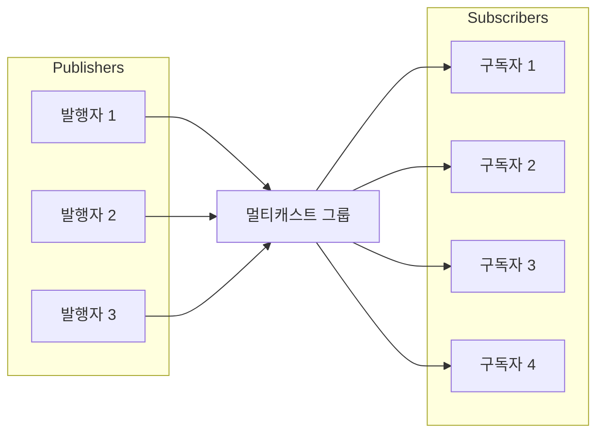

# DoubleZero 멀티캐스트 그룹 관리

**멀티캐스트 그룹**은 공통 식별자(일반적으로 멀티캐스트 IP 주소)를 공유하여 여러 수신자에게 데이터를 효율적으로 전송하는 장치 또는 네트워크 노드의 논리적 집합입니다. 유니캐스트(1:1) 또는 브로드캐스트(1:전체) 통신과 달리 멀티캐스트는 송신자가 단일 데이터 스트림을 전송하면 네트워크가 그룹에 가입한 수신자에게만 이를 복제하여 전달합니다.

이 방식은 패킷이 링크당 한 번만 전송되고 여러 구독자에게 도달하기 위해 필요할 때만 복제되므로 대역폭 사용을 최적화하고 송신자 및 네트워크 인프라의 부하를 줄입니다. 멀티캐스트 그룹은 라이브 비디오 스트리밍, 회의, 금융 데이터 배포, 실시간 메시징 시스템 등의 시나리오에서 일반적으로 사용됩니다.

DoubleZero에서 멀티캐스트 그룹은 각 그룹 내에서 데이터를 보낼 수 있는 사람(발행자)과 받을 수 있는 사람(구독자)을 관리하는 안전하고 제어된 메커니즘을 제공하여 효율적이고 관리되는 정보 배포를 보장합니다.



위 다이어그램은 여러 사용자가 멀티캐스트 그룹에 메시지를 발행하고 여러 사용자가 해당 메시지를 수신하기 위해 구독할 수 있는 방법을 보여줍니다. DoubleZero 네트워크는 패킷을 효율적으로 복제하여 모든 구독자가 불필요한 전송 오버헤드 없이 메시지를 받을 수 있도록 합니다.

## 1. 멀티캐스트 그룹 생성 및 목록 조회

멀티캐스트 그룹은 DoubleZero의 안전하고 효율적인 데이터 배포를 위한 기반입니다. 각 그룹은 고유하게 식별되며 특정 대역폭과 소유자로 구성됩니다. 새 멀티캐스트 그룹은 DoubleZero Foundation 관리자만 생성할 수 있어 적절한 거버넌스와 리소스 할당을 보장합니다.

생성된 멀티캐스트 그룹은 모든 사용 가능한 그룹, 그 구성 및 현재 상태에 대한 개요를 제공하기 위해 목록 조회가 가능합니다. 이는 네트워크 운영자와 그룹 소유자가 리소스를 모니터링하고 액세스를 관리하는 데 필수적입니다.

**멀티캐스트 그룹 생성:**

새 멀티캐스트 그룹은 DoubleZero Foundation만 생성할 수 있습니다. 생성 명령에는 고유 코드, 최대 대역폭, 소유자 공개 키(또는 현재 지불자의 경우 'me')가 필요합니다.

```
doublezero multicast group create --code <CODE> --max-bandwidth <MAX_BANDWIDTH> --owner <OWNER>
```

- `--code <CODE>`: 멀티캐스트 그룹의 고유 코드 (예: mg01)
- `--max-bandwidth <MAX_BANDWIDTH>`: 그룹의 최대 대역폭 (예: 10Gbps, 100Mbps)
- `--owner <OWNER>`: 소유자 공개 키


**모든 멀티캐스트 그룹 목록 조회:**

모든 멀티캐스트 그룹과 요약 정보(그룹 코드, 멀티캐스트 IP, 대역폭, 발행자 및 구독자 수, 상태, 소유자 포함)를 조회하려면:

```
doublezero multicast group list
```

샘플 출력:

```
 account                                      | code             | multicast_ip | max_bandwidth | publishers | subscribers | status    | owner
 3eUvZvcpCtsfJ8wqCZvhiyBhbY2Sjn56JcQWpDwsESyX | jito-shredstream | 233.84.178.2 | 200Mbps       | 8          | 0           | activated | 44NdeuZfjhHg61grggBUBpCvPSs96ogXFDo1eRNSKj42
 8ZmH3bx4k1JNYLyEviNAsCFxRoDoG3Y4ntVCUxu24fUF | mg01             | 233.84.178.0 | 1Gbps         | 0          | 0           | activated | DZfHfcCXTLwgZeCRKQ1FL1UuwAwFAZM93g86NMYpfYan
 2CuZeqMrQsrJ4h4PaAuTEpL3ETHQNkSC2XDo66vbDoxw | reserve          | 233.84.178.1 | 100Kbps       | 0          | 0           | activated | DZfPq5hgfwrSB3aKAvcbua9MXE3CABZ233yj6ymncmnd
 4LezgDr5WZs9XNTgajkJYBsUqfJYSd19rCHekNFCcN5D | turbine          | 233.84.178.3 | 1Gbps         | 0          | 4           | activated | DZfHfcCXTLwgZeCRKQ1FL1UuwAwFAZM93g86NMYpfYan
```


이 명령은 모든 멀티캐스트 그룹과 주요 속성이 포함된 표를 표시합니다:
- `account`: 그룹 계정 주소
- `code`: 멀티캐스트 그룹 코드
- `multicast_ip`: 그룹에 할당된 멀티캐스트 IP 주소
- `max_bandwidth`: 그룹의 최대 허용 대역폭
- `publishers`: 그룹의 발행자 수
- `subscribers`: 그룹의 구독자 수
- `status`: 현재 상태 (예: activated)
- `owner`: 소유자 공개 키


그룹이 생성되면 소유자는 발행자 또는 구독자로 연결할 수 있는 사용자를 관리할 수 있습니다.


## 2. 발행자/구독자 허용 목록 관리

발행자 및 구독자 허용 목록은 DoubleZero의 멀티캐스트 그룹에 대한 액세스를 제어하는 데 필수적입니다. 이 목록은 특정 멀티캐스트 그룹 내에서 데이터를 발행(전송)하거나 구독(수신)할 수 있는 사용자를 명시적으로 정의합니다.

- **발행자 허용 목록:** 발행자 허용 목록에 추가된 사용자만 멀티캐스트 그룹으로 데이터를 보낼 수 있습니다. 이는 승인된 소스만 정보를 배포할 수 있도록 하여 무단 또는 악의적인 발행을 방지합니다.
- **구독자 허용 목록:** 구독자 허용 목록에 있는 사용자만 멀티캐스트 그룹에서 데이터를 구독하고 수신할 수 있습니다. 이는 전송된 정보에 대한 액세스를 보호하여 승인된 수신자만 메시지를 받을 수 있도록 합니다.

이 목록 관리는 그룹 소유자의 책임이며, DoubleZero CLI를 사용하여 승인된 발행자와 구독자를 추가, 제거하거나 볼 수 있습니다. 적절한 허용 목록 관리는 멀티캐스트 통신의 보안, 무결성 및 추적 가능성을 유지하는 데 중요합니다.

> **참고:** 멀티캐스트 그룹에 구독하거나 발행하려면 사용자가 먼저 표준 연결 절차를 따라 DoubleZero에 연결하도록 승인되어야 합니다. 여기에 설명된 허용 목록 명령은 이미 승인된 DoubleZero 사용자를 멀티캐스트 그룹과 연결하기만 합니다. 멀티캐스트 그룹의 허용 목록에 새 IP를 추가하는 것 자체로는 DoubleZero에 대한 액세스가 부여되지 않습니다. 사용자는 멀티캐스트 그룹과 상호 작용하기 전에 이미 일반 승인 프로세스를 완료했어야 합니다.


### 허용 목록에 발행자 추가

```
doublezero multicast group allowlist publisher add --code <CODE> --client-ip <CLIENT_IP> --user-payer <USER_PAYER>
```

- `--code <CODE>`: 발행자를 추가할 멀티캐스트 그룹 코드
- `--client-ip <CLIENT_IP>`: IPv4 형식의 클라이언트 IP 주소
- `--user-payer <USER_PAYER>`: 발행자 공개 키 또는 현재 지불자의 경우 'me'


### 허용 목록에서 발행자 제거

```
doublezero multicast group allowlist publisher remove --code <CODE> --client-ip <CLIENT_IP> --user-payer <USER_PAYER>
```

- `--code <CODE>`: 발행자 허용 목록을 제거할 멀티캐스트 그룹 코드 또는 공개 키
- `--client-ip <CLIENT_IP>`: IPv4 형식의 클라이언트 IP 주소
- `--user-payer <USER_PAYER>`: 발행자 공개 키 또는 현재 지불자의 경우 'me'


### 그룹의 발행자 허용 목록 조회

특정 멀티캐스트 그룹의 허용 목록에 있는 모든 발행자를 조회하려면 다음을 사용합니다:

```
doublezero multicast group allowlist publisher list --code <CODE>
```

- `--code <CODE>`: 발행자 허용 목록을 보려는 멀티캐스트 그룹의 코드.

**예시:**

```
doublezero multicast group allowlist publisher list --code mg01
```

샘플 출력:

```
 account                                      | multicast_group | client_ip       | user_payer
 8ZmH3bx4k1JNYLyEviNAsCFxRoDoG3Y4ntVCUxu24fUF | mg01            | 206.189.166.187 | DZfHfcCXTLwgZeCRKQ1FL1UuwAwFAZM93g86NMYpfYan
 8ZmH3bx4k1JNYLyEviNAsCFxRoDoG3Y4ntVCUxu24fUF | mg01            | 164.92.244.134  | DZfHfcCXTLwgZeCRKQ1FL1UuwAwFAZM93g86NMYpfYan
 8ZmH3bx4k1JNYLyEviNAsCFxRoDoG3Y4ntVCUxu24fUF | mg01            | 186.233.185.50  | DZfHfcCXTLwgZeCRKQ1FL1UuwAwFAZM93g86NMYpfYan
 8ZmH3bx4k1JNYLyEviNAsCFxRoDoG3Y4ntVCUxu24fUF | mg01            | 161.35.58.190   | DZfHfcCXTLwgZeCRKQ1FL1UuwAwFAZM93g86NMYpfYan
 8ZmH3bx4k1JNYLyEviNAsCFxRoDoG3Y4ntVCUxu24fUF | mg01            | 159.223.46.72   | DZfHfcCXTLwgZeCRKQ1FL1UuwAwFAZM93g86NMYpfYan
 8ZmH3bx4k1JNYLyEviNAsCFxRoDoG3Y4ntVCUxu24fUF | mg01            | 204.74.232.130  | DZfHfcCXTLwgZeCRKQ1FL1UuwAwFAZM93g86NMYpfYan
```


이 명령은 지정된 그룹에 연결할 수 있는 현재 승인된 모든 발행자(계정, 그룹 코드, 클라이언트 IP, 사용자 지불자 포함)를 표시합니다.


### 허용 목록에 구독자 추가

```
doublezero multicast group allowlist subscriber add --code <CODE> --client-ip <CLIENT_IP> --user-payer <USER_PAYER>
```

- `--code <CODE>`: 구독자 허용 목록을 추가할 멀티캐스트 그룹 코드 또는 공개 키
- `--client-ip <CLIENT_IP>`: IPv4 형식의 클라이언트 IP 주소
- `--user-payer <USER_PAYER>`: 구독자 공개 키 또는 현재 지불자의 경우 'me'


### 허용 목록에서 구독자 제거

```
doublezero multicast group allowlist subscriber remove --code <CODE> --client-ip <CLIENT_IP> --user-payer <USER_PAYER>
```

- `--code <CODE>`: 구독자 허용 목록을 제거할 멀티캐스트 그룹 코드 또는 공개 키
- `--client-ip <CLIENT_IP>`: IPv4 형식의 클라이언트 IP 주소
- `--user-payer <USER_PAYER>`: 구독자 공개 키 또는 현재 지불자의 경우 'me'


### 그룹의 구독자 허용 목록 조회

특정 멀티캐스트 그룹의 허용 목록에 있는 모든 구독자를 조회하려면 다음을 사용합니다:

```
doublezero multicast group allowlist subscriber list --code <CODE>
```

- `--code <CODE>`: 구독자 허용 목록을 보려는 멀티캐스트 그룹의 코드.

**예시:**

```
doublezero multicast group allowlist subscriber list --code mg01
```

샘플 출력:

```
 account                                      | multicast_group | client_ip       | user_payer
 8ZmH3bx4k1JNYLyEviNAsCFxRoDoG3Y4ntVCUxu24fUF | mg01            | 186.233.185.50  | DZfHfcCXTLwgZeCRKQ1FL1UuwAwFAZM93g86NMYpfYan
 8ZmH3bx4k1JNYLyEviNAsCFxRoDoG3Y4ntVCUxu24fUF | mg01            | 206.189.166.187 | DZfHfcCXTLwgZeCRKQ1FL1UuwAwFAZM93g86NMYpfYan
 8ZmH3bx4k1JNYLyEviNAsCFxRoDoG3Y4ntVCUxu24fUF | mg01            | 164.92.244.134  | DZfHfcCXTLwgZeCRKQ1FL1UuwAwFAZM93g86NMYpfYan
 8ZmH3bx4k1JNYLyEviNAsCFxRoDoG3Y4ntVCUxu24fUF | mg01            | 204.74.232.130  | DZfHfcCXTLwgZeCRKQ1FL1UuwAwFAZM93g86NMYpfYan
 8ZmH3bx4k1JNYLyEviNAsCFxRoDoG3Y4ntVCUxu24fUF | mg01            | 161.35.58.190   | DZfHfcCXTLwgZeCRKQ1FL1UuwAwFAZM93g86NMYpfYan
 8ZmH3bx4k1JNYLyEviNAsCFxRoDoG3Y4ntVCUxu24fUF | mg01            | 159.223.46.72   | DZfHfcCXTLwgZeCRKQ1FL1UuwAwFAZM93g86NMYpfYan
```


이 명령은 지정된 그룹에 연결할 수 있는 현재 승인된 모든 구독자(계정, 그룹 코드, 클라이언트 IP, 사용자 지불자 포함)를 표시합니다.

---

멀티캐스트 연결 및 사용에 대한 자세한 내용은 [기타 멀티캐스트 연결](Other%20Multicast%20Connection.md)을 참조하세요.
