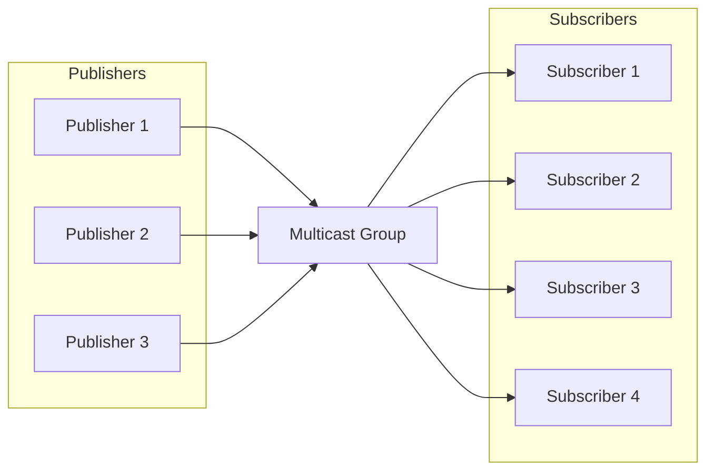

# Multicast Group Management in DoubleZero

A **multicast group** is a logical collection of devices or network nodes that share a common identifier (typically a multicast IP address) to efficiently transmit data to multiple recipients. Unlike unicast (one-to-one) or broadcast (one-to-all) communication, multicast enables a sender to transmit a single data stream that is replicated by the network only for receivers who have joined the group.

This approach optimizes bandwidth usage and reduces load on both the sender and the network infrastructure, as packets are transmitted only once per link and are duplicated only when necessary to reach multiple subscribers. Multicast groups are commonly used in scenarios such as live video streaming, conferencing, financial data distribution, and real-time messaging systems.

In DoubleZero, multicast groups provide a secure and controlled mechanism to manage who can send (publishers) and receive (subscribers) data within each group, ensuring efficient and governed information distribution.



The diagram above shows how multiple users can publish messages to a multicast group, and multiple users can subscribe to receive those messages. The DoubleZero network efficiently replicates packets, ensuring all subscribers receive messages without unnecessary transmission overhead.

## 1. Creating and Listing Multicast Groups

Multicast groups are the foundation for secure and efficient data distribution in DoubleZero. Each group is uniquely identified and configured with a specific bandwidth and owner. Only DoubleZero Foundation administrators can create new multicast groups, ensuring proper governance and resource allocation.

Once created, multicast groups can be listed to provide an overview of all available groups, their configuration, and their current status. This is essential for network operators and group owners to monitor resources and manage access.

**Creating a multicast group:**

Only the DoubleZero Foundation can create new multicast groups. The creation command requires a unique code, the maximum bandwidth, and the owner public key (or 'me' for the current payer).

```
doublezero multicast group create --code <CODE> --max-bandwidth <MAX_BANDWIDTH> --owner <OWNER>
```

- `--code <CODE>`: Unique code for the multicast group (e.g., mg01)
- `--max-bandwidth <MAX_BANDWIDTH>`: Maximum bandwidth for the group (e.g., 10Gbps, 100Mbps)
- `--owner <OWNER>`: Owner public key


**Listing all multicast groups:**

To list all multicast groups and view summary information (including group code, multicast IP, bandwidth, number of publishers and subscribers, status, and owner):

```
doublezero multicast group list
```

Sample output:

```
 account                                      | code             | multicast_ip | max_bandwidth | publishers | subscribers | status    | owner
 3eUvZvcpCtsfJ8wqCZvhiyBhbY2Sjn56JcQWpDwsESyX | jito-shredstream | 233.84.178.2 | 200Mbps       | 8          | 0           | activated | 44NdeuZfjhHg61grggBUBpCvPSs96ogXFDo1eRNSKj42
 8ZmH3bx4k1JNYLyEviNAsCFxRoDoG3Y4ntVCUxu24fUF | mg01             | 233.84.178.0 | 1Gbps         | 0          | 0           | activated | DZfHfcCXTLwgZeCRKQ1FL1UuwAwFAZM93g86NMYpfYan
 2CuZeqMrQsrJ4h4PaAuTEpL3ETHQNkSC2XDo66vbDoxw | reserve          | 233.84.178.1 | 100Kbps       | 0          | 0           | activated | DZfPq5hgfwrSB3aKAvcbua9MXE3CABZ233yj6ymncmnd
 4LezgDr5WZs9XNTgajkJYBsUqfJYSd19rCHekNFCcN5D | turbine          | 233.84.178.3 | 1Gbps         | 0          | 4           | activated | DZfHfcCXTLwgZeCRKQ1FL1UuwAwFAZM93g86NMYpfYan
```


This command displays a table with all multicast groups and their main properties:
- `account`: Group account address
- `code`: Multicast group code
- `multicast_ip`: Multicast IP address assigned to the group
- `max_bandwidth`: Maximum allowed bandwidth for the group
- `publishers`: Number of publishers in the group
- `subscribers`: Number of subscribers in the group
- `status`: Current status (e.g., activated)
- `owner`: Owner public key


Once a group is created, the owner can manage which users are allowed to connect as publishers or subscribers.


## 2. Managing Publisher/Subscriber Allowlists

Publisher and subscriber allowlists are essential for controlling access to multicast groups in DoubleZero. These lists explicitly define which users are permitted to publish (send data) or subscribe (receive data) within a specific multicast group.

- **Publisher allowlist:** Only users added to the publisher allowlist can send data to the multicast group. This ensures that only authorized sources can distribute information, preventing unauthorized or malicious publishing.
- **Subscriber allowlist:** Only users present in the subscriber allowlist can subscribe to and receive data from the multicast group. This protects access to transmitted information, ensuring that only approved recipients can receive messages.

Managing these lists is the responsibility of the group owner, who can add, remove, or view authorized publishers and subscribers using the DoubleZero CLI. Proper allowlist management is critical for maintaining the security, integrity, and traceability of multicast communications.

> **Note:** To subscribe or publish to a multicast group, a user must first be authorized to connect to DoubleZero by following the standard connection procedures. The allowlist commands described here only associate an already authorized DoubleZero user with a multicast group. Adding a new IP to a multicast group’s allowlist does not by itself grant access to DoubleZero; the user must have already completed the general authorization process before interacting with multicast groups.


### Adding a publisher to the allowlist

```
doublezero multicast group allowlist publisher add --code <CODE> --client-ip <CLIENT_IP> --user-payer <USER_PAYER>
```

- `--code <CODE>`: Multicast group code to add the publisher to
- `--client-ip <CLIENT_IP>`: Client IP address in IPv4 format
- `--user-payer <USER_PAYER>`: Publisher public key or 'me' for current payer


### Removing a publisher from the allowlist

```
doublezero multicast group allowlist publisher remove --code <CODE> --client-ip <CLIENT_IP> --user-payer <USER_PAYER>
```

- `--code <CODE>`: Multicast group code or pubkey to remove publisher allowlist for
- `--client-ip <CLIENT_IP>`: Client IP address in IPv4 format
- `--user-payer <USER_PAYER>`: Publisher public key or 'me' for current payer


### Listing the publisher allowlist for a group

To list all publishers in the allowlist for a specific multicast group, use:

```
doublezero multicast group allowlist publisher list --code <CODE>
```

- `--code <CODE>`: The code of the multicast group whose publisher allowlist you want to view.

**Example:**

```
doublezero multicast group allowlist publisher list --code mg01
```

Sample output:

```
 account                                      | multicast_group | client_ip       | user_payer
 8ZmH3bx4k1JNYLyEviNAsCFxRoDoG3Y4ntVCUxu24fUF | mg01            | 206.189.166.187 | DZfHfcCXTLwgZeCRKQ1FL1UuwAwFAZM93g86NMYpfYan
 8ZmH3bx4k1JNYLyEviNAsCFxRoDoG3Y4ntVCUxu24fUF | mg01            | 164.92.244.134  | DZfHfcCXTLwgZeCRKQ1FL1UuwAwFAZM93g86NMYpfYan
 8ZmH3bx4k1JNYLyEviNAsCFxRoDoG3Y4ntVCUxu24fUF | mg01            | 186.233.185.50  | DZfHfcCXTLwgZeCRKQ1FL1UuwAwFAZM93g86NMYpfYan
 8ZmH3bx4k1JNYLyEviNAsCFxRoDoG3Y4ntVCUxu24fUF | mg01            | 161.35.58.190   | DZfHfcCXTLwgZeCRKQ1FL1UuwAwFAZM93g86NMYpfYan
 8ZmH3bx4k1JNYLyEviNAsCFxRoDoG3Y4ntVCUxu24fUF | mg01            | 159.223.46.72   | DZfHfcCXTLwgZeCRKQ1FL1UuwAwFAZM93g86NMYpfYan
 8ZmH3bx4k1JNYLyEviNAsCFxRoDoG3Y4ntVCUxu24fUF | mg01            | 204.74.232.130  | DZfHfcCXTLwgZeCRKQ1FL1UuwAwFAZM93g86NMYpfYan
```


This command displays all publishers currently allowed to connect to the specified group, including their account, group code, client IP, and user payer.


### Adding a subscriber to the allowlist

```
doublezero multicast group allowlist subscriber add --code <CODE> --client-ip <CLIENT_IP> --user-payer <USER_PAYER>
```

- `--code <CODE>`: Multicast group code or pubkey to add subscriber allowlist for
- `--client-ip <CLIENT_IP>`: Client IP address in IPv4 format
- `--user-payer <USER_PAYER>`: Subscriber public key or 'me' for current payer


### Removing a subscriber from the allowlist

```
doublezero multicast group allowlist subscriber remove --code <CODE> --client-ip <CLIENT_IP> --user-payer <USER_PAYER>
```

- `--code <CODE>`: Multicast group code or pubkey to remove subscriber allowlist for
- `--client-ip <CLIENT_IP>`: Client IP address in IPv4 format
- `--user-payer <USER_PAYER>`: Subscriber public key or 'me' for current payer


### Listing the subscriber allowlist for a group

To list all subscribers in the allowlist for a specific multicast group, use:

```
doublezero multicast group allowlist subscriber list --code <CODE>
```

- `--code <CODE>`: The code of the multicast group whose subscriber allowlist you want to view.

**Example:**

```
doublezero multicast group allowlist subscriber list --code mg01
```

Sample output:

```
 account                                      | multicast_group | client_ip       | user_payer
 8ZmH3bx4k1JNYLyEviNAsCFxRoDoG3Y4ntVCUxu24fUF | mg01            | 186.233.185.50  | DZfHfcCXTLwgZeCRKQ1FL1UuwAwFAZM93g86NMYpfYan
 8ZmH3bx4k1JNYLyEviNAsCFxRoDoG3Y4ntVCUxu24fUF | mg01            | 206.189.166.187 | DZfHfcCXTLwgZeCRKQ1FL1UuwAwFAZM93g86NMYpfYan
 8ZmH3bx4k1JNYLyEviNAsCFxRoDoG3Y4ntVCUxu24fUF | mg01            | 164.92.244.134  | DZfHfcCXTLwgZeCRKQ1FL1UuwAwFAZM93g86NMYpfYan
 8ZmH3bx4k1JNYLyEviNAsCFxRoDoG3Y4ntVCUxu24fUF | mg01            | 204.74.232.130  | DZfHfcCXTLwgZeCRKQ1FL1UuwAwFAZM93g86NMYpfYan
 8ZmH3bx4k1JNYLyEviNAsCFxRoDoG3Y4ntVCUxu24fUF | mg01            | 161.35.58.190   | DZfHfcCXTLwgZeCRKQ1FL1UuwAwFAZM93g86NMYpfYan
 8ZmH3bx4k1JNYLyEviNAsCFxRoDoG3Y4ntVCUxu24fUF | mg01            | 159.223.46.72   | DZfHfcCXTLwgZeCRKQ1FL1UuwAwFAZM93g86NMYpfYan
```


This command displays all subscribers currently allowed to connect to the specified group, including their account, group code, client IP, and user payer.

---

For more information about connecting and using multicast, see [Other Multicast Connection](Other%20Multicast%20Connection.md).
