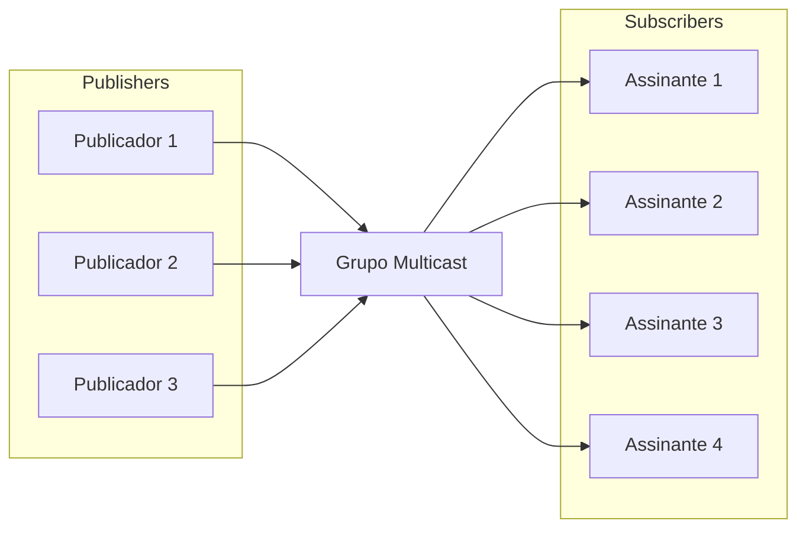

# Gerenciamento de Grupos Multicast no DoubleZero

Um **grupo multicast** é uma coleção lógica de dispositivos ou nós de rede que compartilham um identificador comum (tipicamente um endereço IP multicast) para transmitir dados eficientemente para múltiplos destinatários. Ao contrário da comunicação unicast (um para um) ou broadcast (um para todos), o multicast permite que um remetente transmita um único fluxo de dados que é replicado pela rede apenas para os receptores que ingressaram no grupo.

Esta abordagem otimiza o uso de largura de banda e reduz a carga tanto no remetente quanto na infraestrutura de rede, pois os pacotes são transmitidos apenas uma vez por link e duplicados somente quando necessário para alcançar múltiplos assinantes. Os grupos multicast são comumente usados em cenários como transmissão de vídeo ao vivo, conferências, distribuição de dados financeiros e sistemas de mensagens em tempo real.

No DoubleZero, os grupos multicast fornecem um mecanismo seguro e controlado para gerenciar quem pode enviar (publicadores) e receber (assinantes) dados dentro de cada grupo, garantindo uma distribuição de informações eficiente e governada.



O diagrama acima mostra como múltiplos usuários podem publicar mensagens em um grupo multicast, e múltiplos usuários podem assinar para receber essas mensagens. A rede DoubleZero replica eficientemente os pacotes, garantindo que todos os assinantes recebam as mensagens sem sobrecarga de transmissão desnecessária.

## 1. Criação e Listagem de Grupos Multicast

Os grupos multicast são a base para a distribuição segura e eficiente de dados no DoubleZero. Cada grupo é identificado de forma única e configurado com uma largura de banda e proprietário específicos. Apenas os administradores da Fundação DoubleZero podem criar novos grupos multicast, garantindo uma governança adequada e alocação de recursos.

Uma vez criados, os grupos multicast podem ser listados para fornecer uma visão geral de todos os grupos disponíveis, sua configuração e seu status atual. Isso é essencial para que os operadores de rede e proprietários de grupos monitorem recursos e gerenciem o acesso.

**Criando um grupo multicast:**

Apenas a Fundação DoubleZero pode criar novos grupos multicast. O comando de criação requer um código único, a largura de banda máxima e a chave pública do proprietário (ou 'me' para o pagador atual).

```
doublezero multicast group create --code <CODE> --max-bandwidth <MAX_BANDWIDTH> --owner <OWNER>
```

- `--code <CODE>`: Código único para o grupo multicast (por exemplo, mg01)
- `--max-bandwidth <MAX_BANDWIDTH>`: Largura de banda máxima para o grupo (por exemplo, 10Gbps, 100Mbps)
- `--owner <OWNER>`: Chave pública do proprietário


**Listando todos os grupos multicast:**

Para listar todos os grupos multicast e ver informações resumidas (incluindo o código do grupo, IP multicast, largura de banda, número de publicadores e assinantes, status e proprietário):

```
doublezero multicast group list
```

Este comando exibe uma tabela com todos os grupos multicast e suas principais propriedades.

Uma vez criado um grupo, o proprietário pode gerenciar quais usuários podem se conectar como publicadores ou assinantes.


## 2. Gerenciamento de Listas de Permissão de Publicadores/Assinantes

As listas de permissão de publicadores e assinantes são essenciais para controlar o acesso aos grupos multicast no DoubleZero. Essas listas definem explicitamente quais usuários podem publicar (enviar dados) ou assinar (receber dados) dentro de um grupo multicast específico.

- **Lista de permissão de publicadores:** Apenas os usuários adicionados à lista de permissão de publicadores podem enviar dados ao grupo multicast. Isso garante que apenas fontes autorizadas possam distribuir informações, evitando publicação não autorizada ou maliciosa.
- **Lista de permissão de assinantes:** Apenas os usuários presentes na lista de permissão de assinantes podem assinar e receber dados do grupo multicast. Isso protege o acesso às informações transmitidas, garantindo que apenas destinatários aprovados possam receber mensagens.

Gerenciar essas listas é responsabilidade do proprietário do grupo, que pode adicionar, remover ou visualizar publicadores e assinantes autorizados usando o CLI do DoubleZero.

> **Nota:** Para assinar ou publicar em um grupo multicast, um usuário deve primeiro estar autorizado a se conectar ao DoubleZero seguindo os procedimentos de conexão padrão. Os comandos de lista de permissão descritos aqui apenas associam um usuário DoubleZero já autorizado com um grupo multicast. Adicionar um novo IP à lista de permissão de um grupo multicast não concede por si só acesso ao DoubleZero; o usuário deve ter concluído o processo de autorização geral antes de interagir com grupos multicast.


### Adicionar um publicador à lista de permissão

```
doublezero multicast group allowlist publisher add --code <CODE> --client-ip <CLIENT_IP> --user-payer <USER_PAYER>
```

- `--code <CODE>`: Código do grupo multicast ao qual adicionar o publicador
- `--client-ip <CLIENT_IP>`: Endereço IP do cliente no formato IPv4
- `--user-payer <USER_PAYER>`: Chave pública do publicador ou 'me' para o pagador atual


### Remover um publicador da lista de permissão

```
doublezero multicast group allowlist publisher remove --code <CODE> --client-ip <CLIENT_IP> --user-payer <USER_PAYER>
```

- `--code <CODE>`: Código ou pubkey do grupo multicast para remover da lista de permissão do publicador
- `--client-ip <CLIENT_IP>`: Endereço IP do cliente no formato IPv4
- `--user-payer <USER_PAYER>`: Chave pública do publicador ou 'me' para o pagador atual


### Listar a lista de permissão de publicadores de um grupo

Para listar todos os publicadores na lista de permissão de um grupo multicast específico, use:

```
doublezero multicast group allowlist publisher list --code <CODE>
```

- `--code <CODE>`: O código do grupo multicast cuja lista de permissão de publicadores você deseja ver.

Este comando exibe todos os publicadores atualmente autorizados a se conectar ao grupo especificado, incluindo sua conta, código do grupo, IP do cliente e pagador do usuário.


### Adicionar um assinante à lista de permissão

```
doublezero multicast group allowlist subscriber add --code <CODE> --client-ip <CLIENT_IP> --user-payer <USER_PAYER>
```

- `--code <CODE>`: Código ou pubkey do grupo multicast para adicionar à lista de permissão do assinante
- `--client-ip <CLIENT_IP>`: Endereço IP do cliente no formato IPv4
- `--user-payer <USER_PAYER>`: Chave pública do assinante ou 'me' para o pagador atual


### Remover um assinante da lista de permissão

```
doublezero multicast group allowlist subscriber remove --code <CODE> --client-ip <CLIENT_IP> --user-payer <USER_PAYER>
```

- `--code <CODE>`: Código ou pubkey do grupo multicast para remover da lista de permissão do assinante
- `--client-ip <CLIENT_IP>`: Endereço IP do cliente no formato IPv4
- `--user-payer <USER_PAYER>`: Chave pública do assinante ou 'me' para o pagador atual


### Listar a lista de permissão de assinantes de um grupo

Para listar todos os assinantes na lista de permissão de um grupo multicast específico, use:

```
doublezero multicast group allowlist subscriber list --code <CODE>
```

- `--code <CODE>`: O código do grupo multicast cuja lista de permissão de assinantes você deseja ver.

Este comando exibe todos os assinantes atualmente autorizados a se conectar ao grupo especificado.

---

Para mais informações sobre conexão e uso de multicast, consulte [Outras Conexões Multicast](Other%20Multicast%20Connection.md).
