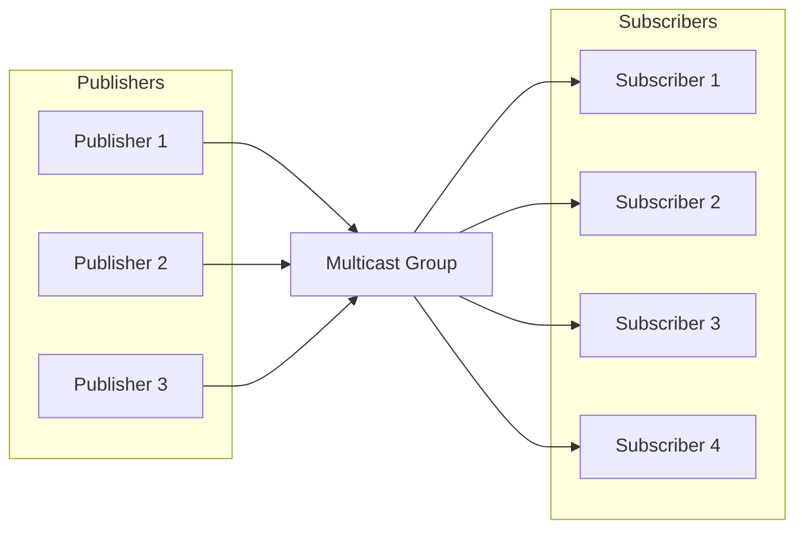

# Gerenciamento de Grupos Multicast no DoubleZero

Um **grupo multicast** é uma coleção lógica de dispositivos ou nós de rede que compartilham um identificador comum (tipicamente um endereço IP multicast) para transmitir dados de forma eficiente a múltiplos destinatários. Diferentemente da comunicação unicast (um-para-um) ou broadcast (um-para-todos), o multicast permite que um remetente transmita um único fluxo de dados que é replicado pela rede apenas para os receptores que ingressaram no grupo.

Essa abordagem otimiza o uso de largura de banda e reduz a carga tanto no remetente quanto na infraestrutura de rede, pois os pacotes são transmitidos apenas uma vez por enlace e são duplicados somente quando necessário para alcançar múltiplos assinantes. Grupos multicast são comumente usados em cenários como transmissão de vídeo ao vivo, conferências, distribuição de dados financeiros e sistemas de mensagens em tempo real.

No DoubleZero, os grupos multicast fornecem um mecanismo seguro e controlado para gerenciar quem pode enviar (publicadores) e receber (assinantes) dados dentro de cada grupo, garantindo uma distribuição de informações eficiente e governada.


```mermaid
flowchart LR
    subgraph Publishers
        P1[Publisher 1]
        P2[Publisher 2]
        P3[Publisher 3]
    end
    subgraph Subscribers
        S1[Subscriber 1]
        S2[Subscriber 2]
        S3[Subscriber 3]
        S4[Subscriber 4]
    end
    P1 --> B[Multicast Group]
    P2 --> B
    P3 --> B
    B --> S1
    B --> S2
    B --> S3
    B --> S4
```

O diagrama acima mostra como múltiplos usuários podem publicar mensagens em um grupo multicast, e múltiplos usuários podem se inscrever para receber essas mensagens. A rede DoubleZero replica os pacotes de forma eficiente, garantindo que todos os assinantes recebam as mensagens sem sobrecarga de transmissão desnecessária.

## 1. Criando e Listando Grupos Multicast

Os grupos multicast são a base para a distribuição segura e eficiente de dados no DoubleZero. Cada grupo é identificado de forma única e configurado com uma largura de banda específica e um proprietário. Apenas administradores da DoubleZero Foundation podem criar novos grupos multicast, garantindo governança adequada e alocação de recursos.

Uma vez criados, os grupos multicast podem ser listados para fornecer uma visão geral de todos os grupos disponíveis, sua configuração e seu estado atual. Isso é essencial para operadores de rede e proprietários de grupos monitorarem recursos e gerenciarem o acesso.

**Criando um grupo multicast:**

Apenas a DoubleZero Foundation pode criar novos grupos multicast. O comando de criação requer um código único, a largura de banda máxima e a chave pública do proprietário (ou 'me' para o pagador atual).

```
doublezero multicast group create --code <CODE> --max-bandwidth <MAX_BANDWIDTH> --owner <OWNER>
```

- `--code <CODE>`: Código único para o grupo multicast (ex.: mg01)
- `--max-bandwidth <MAX_BANDWIDTH>`: Largura de banda máxima para o grupo (ex.: 10Gbps, 100Mbps)
- `--owner <OWNER>`: Chave pública do proprietário


**Listando todos os grupos multicast:**

Para listar todos os grupos multicast e visualizar informações resumidas (incluindo código do grupo, IP multicast, largura de banda, número de publicadores e assinantes, status e proprietário):

```
doublezero multicast group list
```

Saída de exemplo:

```
 account                                      | code             | multicast_ip | max_bandwidth | publishers | subscribers | status    | owner
 3eUvZvcpCtsfJ8wqCZvhiyBhbY2Sjn56JcQWpDwsESyX | jito-shredstream | 233.84.178.2 | 200Mbps       | 8          | 0           | activated | 44NdeuZfjhHg61grggBUBpCvPSs96ogXFDo1eRNSKj42
 8ZmH3bx4k1JNYLyEviNAsCFxRoDoG3Y4ntVCUxu24fUF | mg01             | 233.84.178.0 | 1Gbps         | 0          | 0           | activated | DZfHfcCXTLwgZeCRKQ1FL1UuwAwFAZM93g86NMYpfYan
 2CuZeqMrQsrJ4h4PaAuTEpL3ETHQNkSC2XDo66vbDoxw | reserve          | 233.84.178.1 | 100Kbps       | 0          | 0           | activated | DZfPq5hgfwrSB3aKAvcbua9MXE3CABZ233yj6ymncmnd
 4LezgDr5WZs9XNTgajkJYBsUqfJYSd19rCHekNFCcN5D | turbine          | 233.84.178.3 | 1Gbps         | 0          | 4           | activated | DZfHfcCXTLwgZeCRKQ1FL1UuwAwFAZM93g86NMYpfYan
```


Este comando exibe uma tabela com todos os grupos multicast e suas principais propriedades:
- `account`: Endereço da conta do grupo
- `code`: Código do grupo multicast
- `multicast_ip`: Endereço IP multicast atribuído ao grupo
- `max_bandwidth`: Largura de banda máxima permitida para o grupo
- `publishers`: Número de publicadores no grupo
- `subscribers`: Número de assinantes no grupo
- `status`: Status atual (ex.: activated)
- `owner`: Chave pública do proprietário


Uma vez que um grupo é criado, o proprietário pode gerenciar quais usuários estão autorizados a se conectar como publicadores ou assinantes.


## 2. Gerenciando Listas de Permissão de Publicadores/Assinantes

As listas de permissão de publicadores e assinantes são essenciais para controlar o acesso aos grupos multicast no DoubleZero. Essas listas definem explicitamente quais usuários estão autorizados a publicar (enviar dados) ou se inscrever (receber dados) em um grupo multicast específico.

- **Lista de permissão de publicadores:** Apenas usuários adicionados à lista de permissão de publicadores podem enviar dados ao grupo multicast. Isso garante que apenas fontes autorizadas possam distribuir informações, prevenindo publicação não autorizada ou maliciosa.
- **Lista de permissão de assinantes:** Apenas usuários presentes na lista de permissão de assinantes podem se inscrever e receber dados do grupo multicast. Isso protege o acesso às informações transmitidas, garantindo que apenas destinatários aprovados possam receber mensagens.

O gerenciamento dessas listas é responsabilidade do proprietário do grupo, que pode adicionar, remover ou visualizar publicadores e assinantes autorizados usando a CLI do DoubleZero. O gerenciamento adequado das listas de permissão é fundamental para manter a segurança, integridade e rastreabilidade das comunicações multicast.

> **Nota:** Para se inscrever ou publicar em um grupo multicast, o usuário deve primeiro estar autorizado a se conectar ao DoubleZero seguindo os procedimentos padrão de conexão. Os comandos de lista de permissão descritos aqui apenas associam um usuário já autorizado do DoubleZero a um grupo multicast. Adicionar um novo IP à lista de permissão de um grupo multicast não concede, por si só, acesso ao DoubleZero; o usuário deve ter concluído previamente o processo de autorização geral antes de interagir com grupos multicast.


### Adicionando um publicador à lista de permissão

```
doublezero multicast group allowlist publisher add --code <CODE> --client-ip <CLIENT_IP> --user-payer <USER_PAYER>
```

- `--code <CODE>`: Código do grupo multicast ao qual adicionar o publicador
- `--client-ip <CLIENT_IP>`: Endereço IP do cliente no formato IPv4
- `--user-payer <USER_PAYER>`: Chave pública do publicador ou 'me' para o pagador atual


### Removendo um publicador da lista de permissão

```
doublezero multicast group allowlist publisher remove --code <CODE> --client-ip <CLIENT_IP> --user-payer <USER_PAYER>
```

- `--code <CODE>`: Código ou chave pública do grupo multicast do qual remover a permissão do publicador
- `--client-ip <CLIENT_IP>`: Endereço IP do cliente no formato IPv4
- `--user-payer <USER_PAYER>`: Chave pública do publicador ou 'me' para o pagador atual


### Listando a lista de permissão de publicadores de um grupo

Para listar todos os publicadores na lista de permissão de um grupo multicast específico, use:

```
doublezero multicast group allowlist publisher list --code <CODE>
```

- `--code <CODE>`: O código do grupo multicast cuja lista de permissão de publicadores você deseja visualizar.

**Exemplo:**

```
doublezero multicast group allowlist publisher list --code mg01
```

Saída de exemplo:

```
 account                                      | multicast_group | client_ip       | user_payer
 8ZmH3bx4k1JNYLyEviNAsCFxRoDoG3Y4ntVCUxu24fUF | mg01            | 206.189.166.187 | DZfHfcCXTLwgZeCRKQ1FL1UuwAwFAZM93g86NMYpfYan
 8ZmH3bx4k1JNYLyEviNAsCFxRoDoG3Y4ntVCUxu24fUF | mg01            | 164.92.244.134  | DZfHfcCXTLwgZeCRKQ1FL1UuwAwFAZM93g86NMYpfYan
 8ZmH3bx4k1JNYLyEviNAsCFxRoDoG3Y4ntVCUxu24fUF | mg01            | 186.233.185.50  | DZfHfcCXTLwgZeCRKQ1FL1UuwAwFAZM93g86NMYpfYan
 8ZmH3bx4k1JNYLyEviNAsCFxRoDoG3Y4ntVCUxu24fUF | mg01            | 161.35.58.190   | DZfHfcCXTLwgZeCRKQ1FL1UuwAwFAZM93g86NMYpfYan
 8ZmH3bx4k1JNYLyEviNAsCFxRoDoG3Y4ntVCUxu24fUF | mg01            | 159.223.46.72   | DZfHfcCXTLwgZeCRKQ1FL1UuwAwFAZM93g86NMYpfYan
 8ZmH3bx4k1JNYLyEviNAsCFxRoDoG3Y4ntVCUxu24fUF | mg01            | 204.74.232.130  | DZfHfcCXTLwgZeCRKQ1FL1UuwAwFAZM93g86NMYpfYan
```


Este comando exibe todos os publicadores atualmente autorizados a se conectar ao grupo especificado, incluindo sua conta, código do grupo, IP do cliente e pagador do usuário.


### Adicionando um assinante à lista de permissão

```
doublezero multicast group allowlist subscriber add --code <CODE> --client-ip <CLIENT_IP> --user-payer <USER_PAYER>
```

- `--code <CODE>`: Código ou chave pública do grupo multicast ao qual adicionar a permissão do assinante
- `--client-ip <CLIENT_IP>`: Endereço IP do cliente no formato IPv4
- `--user-payer <USER_PAYER>`: Chave pública do assinante ou 'me' para o pagador atual


### Removendo um assinante da lista de permissão

```
doublezero multicast group allowlist subscriber remove --code <CODE> --client-ip <CLIENT_IP> --user-payer <USER_PAYER>
```

- `--code <CODE>`: Código ou chave pública do grupo multicast do qual remover a permissão do assinante
- `--client-ip <CLIENT_IP>`: Endereço IP do cliente no formato IPv4
- `--user-payer <USER_PAYER>`: Chave pública do assinante ou 'me' para o pagador atual


### Listando a lista de permissão de assinantes de um grupo

Para listar todos os assinantes na lista de permissão de um grupo multicast específico, use:

```
doublezero multicast group allowlist subscriber list --code <CODE>
```

- `--code <CODE>`: O código do grupo multicast cuja lista de permissão de assinantes você deseja visualizar.

**Exemplo:**

```
doublezero multicast group allowlist subscriber list --code mg01
```

Saída de exemplo:

```
 account                                      | multicast_group | client_ip       | user_payer
 8ZmH3bx4k1JNYLyEviNAsCFxRoDoG3Y4ntVCUxu24fUF | mg01            | 186.233.185.50  | DZfHfcCXTLwgZeCRKQ1FL1UuwAwFAZM93g86NMYpfYan
 8ZmH3bx4k1JNYLyEviNAsCFxRoDoG3Y4ntVCUxu24fUF | mg01            | 206.189.166.187 | DZfHfcCXTLwgZeCRKQ1FL1UuwAwFAZM93g86NMYpfYan
 8ZmH3bx4k1JNYLyEviNAsCFxRoDoG3Y4ntVCUxu24fUF | mg01            | 164.92.244.134  | DZfHfcCXTLwgZeCRKQ1FL1UuwAwFAZM93g86NMYpfYan
 8ZmH3bx4k1JNYLyEviNAsCFxRoDoG3Y4ntVCUxu24fUF | mg01            | 204.74.232.130  | DZfHfcCXTLwgZeCRKQ1FL1UuwAwFAZM93g86NMYpfYan
 8ZmH3bx4k1JNYLyEviNAsCFxRoDoG3Y4ntVCUxu24fUF | mg01            | 161.35.58.190   | DZfHfcCXTLwgZeCRKQ1FL1UuwAwFAZM93g86NMYpfYan
 8ZmH3bx4k1JNYLyEviNAsCFxRoDoG3Y4ntVCUxu24fUF | mg01            | 159.223.46.72   | DZfHfcCXTLwgZeCRKQ1FL1UuwAwFAZM93g86NMYpfYan
```


Este comando exibe todos os assinantes atualmente autorizados a se conectar ao grupo especificado, incluindo sua conta, código do grupo, IP do cliente e pagador do usuário.

---

Para mais informações sobre como conectar e usar multicast, consulte [Outra Conexão Multicast](Other%20Multicast%20Connection.md).