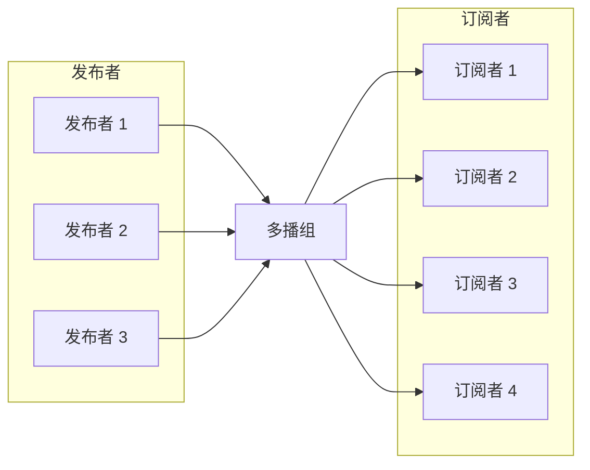

!!! warning "This translation was generated using artificial intelligence and has not been reviewed by a human translator. It may contain inaccuracies or errors and should not be relied upon."

# DoubleZero中的多播组管理

**多播组**是共享公共标识符（通常是多播IP地址）的设备或网络节点的逻辑集合，用于高效地向多个接收者传输数据。与单播（一对一）或广播（一对全部）通信不同，多播使发送方能够传输单个数据流，网络仅为已加入该组的接收者复制该数据流。

这种方法优化了带宽使用，并减少了发送方和网络基础设施的负载，因为数据包在每条链路上只传输一次，仅在必要时才会复制以到达多个订阅者。多播组通常用于实时视频流、会议、金融数据分发和实时消息系统等场景。

在DoubleZero中，多播组提供了一种安全且受控的机制，用于管理谁可以在每个组内发送（发布者）和接收（订阅者）数据，确保高效且受治理的信息分发。



上图显示了多个用户如何向多播组发布消息，以及多个用户如何订阅接收这些消息。DoubleZero网络高效地复制数据包，确保所有订阅者都能收到消息，而不会产生不必要的传输开销。

## 1. 创建和列出多播组

多播组是DoubleZero中安全高效数据分发的基础。每个组都有唯一标识，并配置了特定的带宽和所有者。只有DoubleZero基金会管理员才能创建新的多播组，确保适当的治理和资源分配。

创建后，可以列出多播组，以提供所有可用组、其配置和当前状态的概览。这对于网络运营商和组所有者监控资源和管理访问至关重要。

**创建多播组：**

只有DoubleZero基金会才能创建新的多播组。创建命令需要唯一代码、最大带宽和所有者公钥（或当前付款人的"me"）。

```
doublezero multicast group create --code <CODE> --max-bandwidth <MAX_BANDWIDTH> --owner <OWNER>
```

- `--code <CODE>`：多播组的唯一代码（如mg01）
- `--max-bandwidth <MAX_BANDWIDTH>`：组的最大带宽（如10Gbps、100Mbps）
- `--owner <OWNER>`：所有者公钥


**列出所有多播组：**

要列出所有多播组并查看摘要信息（包括组代码、多播IP、带宽、发布者和订阅者数量、状态和所有者）：

```
doublezero multicast group list
```

示例输出：

```
 account                                      | code             | multicast_ip | max_bandwidth | publishers | subscribers | status    | owner
 3eUvZvcpCtsfJ8wqCZvhiyBhbY2Sjn56JcQWpDwsESyX | jito-shredstream | 233.84.178.2 | 200Mbps       | 8          | 0           | activated | 44NdeuZfjhHg61grggBUBpCvPSs96ogXFDo1eRNSKj42
 8ZmH3bx4k1JNYLyEviNAsCFxRoDoG3Y4ntVCUxu24fUF | mg01             | 233.84.178.0 | 1Gbps         | 0          | 0           | activated | DZfHfcCXTLwgZeCRKQ1FL1UuwAwFAZM93g86NMYpfYan
 2CuZeqMrQsrJ4h4PaAuTEpL3ETHQNkSC2XDo66vbDoxw | reserve          | 233.84.178.1 | 100Kbps       | 0          | 0           | activated | DZfPq5hgfwrSB3aKAvcbua9MXE3CABZ233yj6ymncmnd
 4LezgDr5WZs9XNTgajkJYBsUqfJYSd19rCHekNFCcN5D | turbine          | 233.84.178.3 | 1Gbps         | 0          | 4           | activated | DZfHfcCXTLwgZeCRKQ1FL1UuwAwFAZM93g86NMYpfYan
```


此命令显示包含所有多播组及其主要属性的表格：
- `account`：组账户地址
- `code`：多播组代码
- `multicast_ip`：分配给组的多播IP地址
- `max_bandwidth`：组允许的最大带宽
- `publishers`：组中的发布者数量
- `subscribers`：组中的订阅者数量
- `status`：当前状态（如activated）
- `owner`：所有者公钥


创建组后，所有者可以管理哪些用户可以作为发布者或订阅者连接。


## 2. 管理发布者/订阅者允许列表

发布者和订阅者允许列表对于控制DoubleZero中多播组的访问至关重要。这些列表明确定义了哪些用户被允许在特定多播组内发布（发送数据）或订阅（接收数据）。

- **发布者允许列表：** 只有添加到发布者允许列表的用户才能向多播组发送数据。这确保只有授权的来源才能分发信息，防止未经授权或恶意的发布。
- **订阅者允许列表：** 只有订阅者允许列表中的用户才能订阅和接收来自多播组的数据。这保护了传输信息的访问，确保只有经批准的接收者才能收到消息。

管理这些列表是组所有者的责任，他可以使用DoubleZero CLI添加、删除或查看授权的发布者和订阅者。适当的允许列表管理对于维护多播通信的安全性、完整性和可追溯性至关重要。

> **注意：** 要订阅或发布到多播组，用户必须首先按照标准连接程序获得连接到DoubleZero的授权。这里描述的允许列表命令仅将已授权的DoubleZero用户与多播组关联。将新IP添加到多播组的允许列表本身不授予对DoubleZero的访问权限；用户必须在与多播组交互之前已完成一般授权流程。


### 将发布者添加到允许列表

```
doublezero multicast group allowlist publisher add --code <CODE> --client-ip <CLIENT_IP> --user-payer <USER_PAYER>
```

- `--code <CODE>`：要添加发布者的多播组代码
- `--client-ip <CLIENT_IP>`：IPv4格式的客户端IP地址
- `--user-payer <USER_PAYER>`：发布者公钥或当前付款人的"me"


### 从允许列表中删除发布者

```
doublezero multicast group allowlist publisher remove --code <CODE> --client-ip <CLIENT_IP> --user-payer <USER_PAYER>
```

- `--code <CODE>`：要删除发布者允许列表的多播组代码或公钥
- `--client-ip <CLIENT_IP>`：IPv4格式的客户端IP地址
- `--user-payer <USER_PAYER>`：发布者公钥或当前付款人的"me"


### 列出组的发布者允许列表

要列出特定多播组允许列表中的所有发布者，请使用：

```
doublezero multicast group allowlist publisher list --code <CODE>
```

- `--code <CODE>`：您要查看其发布者允许列表的多播组的代码。

**示例：**

```
doublezero multicast group allowlist publisher list --code mg01
```

示例输出：

```
 account                                      | multicast_group | client_ip       | user_payer
 8ZmH3bx4k1JNYLyEviNAsCFxRoDoG3Y4ntVCUxu24fUF | mg01            | 206.189.166.187 | DZfHfcCXTLwgZeCRKQ1FL1UuwAwFAZM93g86NMYpfYan
 8ZmH3bx4k1JNYLyEviNAsCFxRoDoG3Y4ntVCUxu24fUF | mg01            | 164.92.244.134  | DZfHfcCXTLwgZeCRKQ1FL1UuwAwFAZM93g86NMYpfYan
 8ZmH3bx4k1JNYLyEviNAsCFxRoDoG3Y4ntVCUxu24fUF | mg01            | 186.233.185.50  | DZfHfcCXTLwgZeCRKQ1FL1UuwAwFAZM93g86NMYpfYan
 8ZmH3bx4k1JNYLyEviNAsCFxRoDoG3Y4ntVCUxu24fUF | mg01            | 161.35.58.190   | DZfHfcCXTLwgZeCRKQ1FL1UuwAwFAZM93g86NMYpfYan
 8ZmH3bx4k1JNYLyEviNAsCFxRoDoG3Y4ntVCUxu24fUF | mg01            | 159.223.46.72   | DZfHfcCXTLwgZeCRKQ1FL1UuwAwFAZM93g86NMYpfYan
 8ZmH3bx4k1JNYLyEviNAsCFxRoDoG3Y4ntVCUxu24fUF | mg01            | 204.74.232.130  | DZfHfcCXTLwgZeCRKQ1FL1UuwAwFAZM93g86NMYpfYan
```


此命令显示当前允许连接到指定组的所有发布者，包括其账户、组代码、客户端IP和用户付款人。


### 将订阅者添加到允许列表

```
doublezero multicast group allowlist subscriber add --code <CODE> --client-ip <CLIENT_IP> --user-payer <USER_PAYER>
```

- `--code <CODE>`：要添加订阅者允许列表的多播组代码或公钥
- `--client-ip <CLIENT_IP>`：IPv4格式的客户端IP地址
- `--user-payer <USER_PAYER>`：订阅者公钥或当前付款人的"me"


### 从允许列表中删除订阅者

```
doublezero multicast group allowlist subscriber remove --code <CODE> --client-ip <CLIENT_IP> --user-payer <USER_PAYER>
```

- `--code <CODE>`：要删除订阅者允许列表的多播组代码或公钥
- `--client-ip <CLIENT_IP>`：IPv4格式的客户端IP地址
- `--user-payer <USER_PAYER>`：订阅者公钥或当前付款人的"me"


### 列出组的订阅者允许列表

要列出特定多播组允许列表中的所有订阅者，请使用：

```
doublezero multicast group allowlist subscriber list --code <CODE>
```

- `--code <CODE>`：您要查看其订阅者允许列表的多播组的代码。

**示例：**

```
doublezero multicast group allowlist subscriber list --code mg01
```

示例输出：

```
 account                                      | multicast_group | client_ip       | user_payer
 8ZmH3bx4k1JNYLyEviNAsCFxRoDoG3Y4ntVCUxu24fUF | mg01            | 186.233.185.50  | DZfHfcCXTLwgZeCRKQ1FL1UuwAwFAZM93g86NMYpfYan
 8ZmH3bx4k1JNYLyEviNAsCFxRoDoG3Y4ntVCUxu24fUF | mg01            | 206.189.166.187 | DZfHfcCXTLwgZeCRKQ1FL1UuwAwFAZM93g86NMYpfYan
 8ZmH3bx4k1JNYLyEviNAsCFxRoDoG3Y4ntVCUxu24fUF | mg01            | 164.92.244.134  | DZfHfcCXTLwgZeCRKQ1FL1UuwAwFAZM93g86NMYpfYan
 8ZmH3bx4k1JNYLyEviNAsCFxRoDoG3Y4ntVCUxu24fUF | mg01            | 204.74.232.130  | DZfHfcCXTLwgZeCRKQ1FL1UuwAwFAZM93g86NMYpfYan
 8ZmH3bx4k1JNYLyEviNAsCFxRoDoG3Y4ntVCUxu24fUF | mg01            | 161.35.58.190   | DZfHfcCXTLwgZeCRKQ1FL1UuwAwFAZM93g86NMYpfYan
 8ZmH3bx4k1JNYLyEviNAsCFxRoDoG3Y4ntVCUxu24fUF | mg01            | 159.223.46.72   | DZfHfcCXTLwgZeCRKQ1FL1UuwAwFAZM93g86NMYpfYan
```


此命令显示当前允许连接到指定组的所有订阅者，包括其账户、组代码、客户端IP和用户付款人。

---

有关连接和使用多播的更多信息，请参阅[其他多播连接](Other%20Multicast%20Connection.md)。
