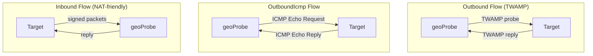

# Work Plan: Issue #165 — Geolocation Documentation Update

**Revision 4** — Addresses operator feedback: rename contributor doc, mark ledger as future, simplify diagrams, remove Architecture section from contributor doc, add RFC 16 reference to user doc.

## Summary

Issue #165 asks us to update the geolocation documentation. Revisions 1–3 created two documents (`docs/geolocation.md` and `docs/contribute-geoprobe.md`) and integrated them into the site nav. Both documents are now written and committed. Revision 4 addresses the operator's latest round of feedback with five targeted changes to the existing content.

## Changes Required (Revision 4)

### Change 1: Rename `docs/contribute-geoprobe.md` → `docs/contribute-geolocation.md`

Rename the contributor document file and update all references:

- **`docs/contribute-geoprobe.md`** → **`docs/contribute-geolocation.md`** (git mv)
- **`mkdocs.yml`** line 73: change `contribute-geoprobe.md` → `contribute-geolocation.md`
- **`docs/contribute-overview.md`**: update any link to `contribute-geoprobe.md` → `contribute-geolocation.md`
- **`docs/geolocation.md`**: if any cross-references exist to the contributor doc, update them (currently the user doc does not link to the contributor doc, so this may be a no-op)

### Change 2: Mark DZ Ledger writing as a future feature in `docs/geolocation.md`

The current first diagram (lines 11–28) shows the probe writing signed measurements onchain to the "DoubleZero Ledger". The intro text (line 3) says "onchain proof" and line 66 says "All measurements are cryptographically signed and recorded onchain." These need to be updated to indicate that onchain ledger recording is a **planned future feature**, not currently implemented.

Specific edits:

- **Line 3 (intro paragraph)**: Change "cryptographically-signed, onchain proof" to indicate the measurements are cryptographically signed, with onchain recording planned as a future feature.
- **First mermaid diagram (lines 11–28)**: Modify the `Ledger` node and its connection to indicate it is a future feature. Options:
  - Add a dashed/dotted line style to the Probe→Ledger connection (mermaid supports `-.->` for dashed arrows)
  - Label the Ledger node or connection as "(future)"
  - Or remove the Ledger node entirely and add a text note below the diagram
  
  Recommended approach: keep the Ledger node but use a dashed arrow and "(future)" label so users understand the planned architecture:
  ```
  Probe -. "signed measurements\n(future)" .-> Ledger
  ```

- **Line 66**: Change "All measurements are cryptographically signed and recorded onchain." to note that measurements are cryptographically signed, and onchain recording is planned for a future release.

### Change 3: Remove DZD→Probe connection from 2nd diagram in `docs/geolocation.md`

The second mermaid diagram (lines 32–55) currently has a top-level DZD node connected via TWAMP to the Probe:

```mermaid
DZD["DZD (known location)"]
Probe["geoProbe"]
DZD -- "TWAMP" --> Probe
```

Per operator feedback, remove these three lines (and any connecting edges) so the second diagram only shows the three flow-type subgraphs (Outbound, OutboundIcmp, Inbound) without the DZD→Probe prefix. The DZD→Probe relationship is already explained in the first diagram and in prose — showing it again in the flow-type comparison diagram is redundant.

The resulting diagram should be:



### Change 4: Remove Architecture section from `docs/contribute-geolocation.md`

The Architecture section (current lines 9–47 in `contribute-geoprobe.md`) contains the three RFC 16 diagrams (outbound flow, inbound flow, onchain account structure). Per operator feedback, remove this entire section. The existing intro paragraph already links to `geolocation.md` ("the bare metal servers that perform latency measurements for the DoubleZero [Geolocation](geolocation.md) service"), which serves as sufficient cross-reference.

Optionally, add a brief sentence after the intro directing readers to the user doc for architecture context, e.g.: "For an overview of the geolocation architecture and measurement flows, see the [Geolocation user guide](geolocation.md)." — but the operator noted the reference already exists, so the existing link in the first paragraph may suffice.

Lines to remove: everything from `## Architecture` through the `---` separator before `## Prerequisites` (approximately lines 9–48 of the current file).

### Change 5: Add RFC 16 reference in `docs/geolocation.md`

Add a reference to [RFC 16](https://github.com/malbeclabs/doublezero/blob/main/rfcs/rfc16-geolocation-verification.md) in the user-facing geolocation doc. This gives users a pointer to the full technical specification.

Recommended placement: add an admonition or note at the end of the "How it works" section (after the probe flow types subsection, around line 98), similar to the one that was in the contributor doc:

```markdown
!!! info "Technical Specification"
    For the full technical specification of the geolocation verification system, including cryptographic signing details and the measurement protocol, see [RFC 16: Geolocation Verification](https://github.com/malbeclabs/doublezero/blob/main/rfcs/rfc16-geolocation-verification.md).
```

## Files to Change

| File | Action | Description |
|------|--------|-------------|
| `docs/contribute-geoprobe.md` | **Rename** → `docs/contribute-geolocation.md` | Rename file per operator feedback |
| `docs/contribute-geolocation.md` | **Modify** | Remove Architecture section (lines 9–48); the intro already links to `geolocation.md` |
| `docs/geolocation.md` | **Modify** | (a) Mark ledger writing as future in intro, diagram, and prose; (b) Remove DZD→Probe from 2nd diagram; (c) Add RFC 16 reference |
| `mkdocs.yml` | **Modify** | Update nav: `contribute-geoprobe.md` → `contribute-geolocation.md` |
| `docs/contribute-overview.md` | **Modify** | Update link from `contribute-geoprobe.md` → `contribute-geolocation.md` (if present) |

## Implementation Order

1. `git mv docs/contribute-geoprobe.md docs/contribute-geolocation.md`
2. Edit `docs/contribute-geolocation.md` — remove Architecture section
3. Edit `docs/geolocation.md` — all three sub-changes (ledger as future, simplify 2nd diagram, add RFC 16 ref)
4. Edit `mkdocs.yml` — update nav reference
5. Edit `docs/contribute-overview.md` — update link if present
6. Verify with `mkdocs serve` (or `mkdocs build`) that all pages render and links resolve

## Risks & Considerations

1. **Dashed arrows in mermaid**: Mermaid supports `-. "label" .->` for dashed arrows. Need to verify this renders correctly with mkdocs-material's mermaid integration (pymdownx.superfences). If dashed arrows don't render well, fall back to adding "(future)" text annotation below the diagram instead.

2. **Translation files**: Renaming `contribute-geoprobe.md` to `contribute-geolocation.md` may affect translated versions (e.g., `contribute-geoprobe.es.md`). Check whether translated versions exist and rename them accordingly, or let the translation workflow regenerate them.

3. **Existing links**: Any other docs that link to `contribute-geoprobe.md` (the glossary, other contributor docs) need updating. A grep for `contribute-geoprobe` across the docs directory will catch these.

## Testing Strategy

1. **Link validation**: `grep -r "contribute-geoprobe" docs/` to ensure no stale references remain after rename
2. **Build check**: `mkdocs build` to verify no broken links or rendering issues
3. **Diagram rendering**: Confirm the modified mermaid diagrams (dashed ledger arrow, simplified flow-type diagram) render correctly
4. **Nav verification**: Confirm the renamed file appears correctly in the Contributors nav section

## Estimated Scope

~5 files modified, ~50 lines changed (mostly deletions from removing the Architecture section and simplifying diagrams). All changes are documentation — **0 lines** count against the 500-line threshold.

## Resolved Questions (Cumulative)

1. **Nav placement**: Resolved (Rev 3) — `geolocation.md` under Users, contributor doc under Contributors.
2. **Geoprobe-agent package name**: Resolved (Rev 1) — `doublezero-geoprobe-agent`.
3. **OutboundIcmp coverage**: Resolved (Rev 1) — fully documented with subsection, diagram, and examples.
4. **RFC architecture diagrams**: Resolved (Rev 2, **updated Rev 4**) — Diagrams removed from contributor doc per operator feedback. RFC 16 reference added to user doc instead.
5. **DZD telemetry agent version**: Resolved (Rev 2) — Warning admonition in contributor doc Prerequisites.
6. **Contributor doc filename**: Resolved (Rev 4) — Renamed from `contribute-geoprobe.md` to `contribute-geolocation.md`.
7. **DZ Ledger onchain recording**: Resolved (Rev 4) — Marked as a future feature in diagrams and prose in `geolocation.md`.
8. **2nd diagram DZD→Probe connection**: Resolved (Rev 4) — Removed per operator feedback; the flow-type comparison diagram only shows the three geoProbe↔Target flows.
9. **RFC 16 reference placement**: Resolved (Rev 4) — Added as an `!!! info` admonition at the end of the "How it works" section in `geolocation.md`.
